# OrbitCommerce

### Plataforma Distribuída de E-commerce Orientada a Eventos

> [!abstract] Stack Principal **Linguagens/Runtime:** Java 25 (LTS) · Kotlin + Coroutines <!-- [ATUALIZADO] Java 21 → 25 LTS --> **Frameworks:** Spring Boot 4 · Quarkus **Mensageria:** Apache Kafka · RabbitMQ **Dados:** PostgreSQL 16 · Redis 7 **Nuvem:** AWS (EKS, RDS, ElastiCache, ECR, MSK) — [[#13 Portabilidade de Nuvem Adaptando o Projeto para Microsoft Azure|ver alternativa Azure na seção 13]] **Infra:** Docker · Docker Compose · Helm · GitHub Actions (CI/CD) **Testes:** JUnit 5 · Mockito · Testcontainers **Observabilidade:** Prometheus · Grafana · OpenTelemetry · Jaeger

**Documento de Arquitetura de Software (SAD) — Versão 1.0** _Especificação de domínio, modelo de dados, contratos de API e de eventos_ _Elaborado para fins de portfólio técnico e avaliação de candidatura profissional_ Julho de 2026

> [!info]- Nota sobre esta versão do documento Este arquivo foi reformatado para uso no Obsidian (headers nativos, tabelas reais, blocos de código com syntax highlighting e callouts) a partir do SAD original. O conteúdo técnico é o mesmo; apenas a apresentação mudou. A stack de nuvem foi migrada de **Microsoft Azure** para **AWS** — ver a [[#13 Portabilidade de Nuvem Adaptando o Projeto para Microsoft Azure|seção 13]] para o caminho de volta.

---

## Sumário

- [[#1 Introdução e Visão Geral do Projeto|1. Introdução e Visão Geral do Projeto]]
    - [[#1.1 Objetivo do Documento|1.1 Objetivo do Documento]]
    - [[#1.2 Escopo do Sistema|1.2 Escopo do Sistema]]
    - [[#1.3 Stack Tecnológica e Justificativas|1.3 Stack Tecnológica e Justificativas]]
    - [[#1.4 Requisitos Não Funcionais|1.4 Requisitos Não Funcionais]]
- [[#2 Arquitetura da Solução|2. Arquitetura da Solução]]
    - [[#2.1 Diagrama de Contexto|2.1 Diagrama de Contexto]]
    - [[#2.2 Diagrama de Containers|2.2 Diagrama de Containers]]
    - [[#2.3 Padrões Arquiteturais Utilizados|2.3 Padrões Arquiteturais Utilizados]]
    - [[#2.4 Estratégia de Comunicação entre Serviços|2.4 Estratégia de Comunicação entre Serviços]]
    - [[#2.5 Padrão Saga Orquestração — Visão Geral|2.5 Padrão Saga (Orquestração) — Visão Geral]]
- [[#3 Especificação dos Serviços|3. Especificação dos Serviços]]
    - [[#3.1 API Gateway|3.1 API Gateway]]
    - [[#3.2 Identity Service|3.2 Identity Service]]
    - [[#3.3 Catalog Service|3.3 Catalog Service]]
    - [[#3.4 Order Service Saga Orchestrator|3.4 Order Service (Saga Orchestrator)]]
    - [[#3.5 Inventory Service|3.5 Inventory Service]]
    - [[#3.6 Payment Service|3.6 Payment Service]]
    - [[#3.7 Shipping Service|3.7 Shipping Service]]
    - [[#3.8 Notification Service|3.8 Notification Service]]
- [[#4 Fluxos Principais Diagramas de Sequência|4. Fluxos Principais (Diagramas de Sequência)]]
- [[#5 Catálogo de Contratos de Eventos e Mensagens|5. Catálogo de Contratos de Eventos e Mensagens]]
- [[#6 Segurança|6. Segurança]]
- [[#7 Observabilidade|7. Observabilidade]]
- [[#8 Estratégia de Testes|8. Estratégia de Testes]]
- [[#9 Infraestrutura Contêineres e CICD|9. Infraestrutura, Contêineres e CI/CD]]
- [[#10 Organização de Repositórios e Estrutura de Pastas|10. Organização de Repositórios e Estrutura de Pastas]]
- [[#11 Roadmap de Implementação Sugerido Portfólio|11. Roadmap de Implementação Sugerido (Portfólio)]]
- [[#12 Glossário e Referências|12. Glossário e Referências]]
- [[#13 Portabilidade de Nuvem Adaptando o Projeto para Microsoft Azure|13. Portabilidade de Nuvem: Adaptando o Projeto para Microsoft Azure]] 🆕

---

## 1. Introdução e Visão Geral do Projeto

OrbitCommerce é uma plataforma de e-commerce construída sob uma arquitetura de **microsserviços orientada a eventos** (event-driven microservices), projetada para demonstrar, de ponta a ponta, práticas de engenharia de software usadas em sistemas distribuídos de médio/alto porte:

- Desacoplamento por domínio de negócio (**Domain-Driven Design**);
- Consistência eventual via coreografia/orquestração de **sagas**;
- Comunicação síncrona e assíncrona;
- Observabilidade completa (métricas, logs e tracing distribuído);
- Testes automatizados em múltiplas camadas;
- Entrega contínua para nuvem pública.

O sistema resolve um problema de negócio realista — o ciclo de vida completo de um pedido de e-commerce, do carrinho à entrega — e o modela como um conjunto de **oito serviços autônomos**, cada um com seu próprio banco de dados (padrão _Database per Service_), comunicando-se por contratos bem definidos de API REST e de eventos.

### 1.1 Objetivo do Documento

Este documento é o Documento de Arquitetura de Software (SAD) do OrbitCommerce e tem como objetivo ser a **fonte única de verdade** para qualquer desenvolvedor implementar o sistema do zero, sem necessidade de decisões de design adicionais. Para isso, ele especifica, para cada serviço:

- Responsabilidades de domínio e limites de contexto (_bounded context_);
- Modelo de classes de domínio, com atributos, tipos e relacionamentos (multiplicidade, agregação, composição, herança);
- Modelo de dados físico (tabelas, colunas, tipos SQL, chaves primárias/estrangeiras, índices e constraints);
- Contrato de API REST — método, rota, parâmetros, corpo de requisição/resposta e códigos de status HTTP;
- Contratos de eventos publicados/consumidos em Kafka e comandos trocados via RabbitMQ, incluindo o schema JSON de payload;
- Requisitos não funcionais específicos (resiliência, cache, idempotência).

### 1.2 Escopo do Sistema

**Dentro do escopo:** cadastro e autenticação de usuários; navegação e busca de catálogo de produtos com cache; criação e acompanhamento de pedidos; reserva e baixa de estoque; autorização, captura e estorno de pagamentos (integração simulada com gateway externo); geração de remessas e rastreamento de entrega (integração simulada com transportadora); envio de notificações transacionais multicanal (e-mail, SMS, push).

> [!warning] Fora do escopo desta primeira versão Carrinho de compras persistente como serviço separado (tratado como estado do lado do cliente até a criação do pedido); motor de recomendação; precificação dinâmica; integração real com gateways de pagamento/transportadoras (usam-se adaptadores mock com contrato de API compatível com provedores reais, permitindo troca futura sem impacto no domínio).

### 1.3 Stack Tecnológica e Justificativas

A stack é deliberadamente poliglota para demonstrar critério na escolha de tecnologia por tipo de carga de trabalho, e não simplesmente uniformidade por conveniência:

|Categoria|Tecnologia|Onde é usada e por quê|
|---|---|---|
|Linguagem / Runtime|**Java 25 (LTS)** <!-- [ATUALIZADO] era Java 21 (LTS) -->|Identity, Catalog, Order e Payment Services — domínios com regras de negócio complexas, transações ACID e forte tipagem estática, onde o ecossistema maduro do Spring (validação, segurança, JPA) reduz risco. LTS lançada em set/2025 (suporte até 2030); traz o conserto de _pinning_ de Virtual Threads em blocos `synchronized` (JEP 491) e finaliza Scoped Values (JEP 506) como alternativa a `ThreadLocal` — ver [[#1.3.1 Nota de Design Virtual Threads em vez de WebFlux no API Gateway\|1.3.1]].|
|Linguagem / Runtime|**Kotlin + Coroutines**|Inventory, Shipping e Notification Services — cargas de trabalho de alta concorrência e I/O-bound (consumo intenso de eventos, chamadas a APIs externas), onde coroutines oferecem concorrência estruturada e leve sem o overhead de threads bloqueantes.|
|Framework Web|**Spring Boot 4** (Spring MVC + Spring Security + Spring Data JPA)|Serviços em Java: injeção de dependência madura, ecossistema de segurança (OAuth2 Resource Server/JWT) e integração nativa com observabilidade (Micrometer).|
|Framework Web|**Quarkus** (Kotlin, modo reativo com Mutiny/Coroutines)|Serviços em Kotlin: tempo de inicialização e footprint de memória muito menores, ideais para escalonamento horizontal agressivo em Kubernetes/AWS Fargate, com suporte nativo a compilação GraalVM.|
|Concorrência do Gateway|**Java 25 Virtual Threads** <!-- [ATUALIZADO] era Java 21 --> (Project Loom)|API Gateway (Spring Cloud Gateway Server MVC) — concorrência massiva com programação síncrona e imperativa, sem o overhead cognitivo de Mono/Flux. Ver [[#1.3.1 Nota de Design Virtual Threads em vez de WebFlux no API Gateway|
|Persistência ORM|**JPA / Hibernate** (Spring Data JPA e Quarkus Hibernate ORM with Panache)|Mapeamento objeto-relacional consistente em todos os serviços com banco relacional.|
|Mensageria de eventos|**Apache Kafka**|Backbone de eventos de domínio entre Order/Inventory/Payment/Shipping — alto throughput, retenção/replay de eventos, particionamento por `orderId` garantindo ordenação por pedido.|
|Mensageria de comandos|**RabbitMQ**|Filas de trabalho (_work queues_) para tarefas pontuais e paralelizáveis como envio de notificações, com suporte nativo a retry, TTL e Dead Letter Exchange (DLX).|
|Banco relacional|**PostgreSQL 16**|Um schema/instância lógica por serviço (_Database per Service_), garantindo isolamento de falhas e evolução independente de cada domínio.|
|Cache distribuído|**Redis 7**|Cache de leitura (cache-aside) no Catalog Service, cache de sessão/token no Identity Service e chaves de idempotência no Order Service.|
|Nuvem|**Amazon Web Services (AWS)**|Amazon EKS para orquestração de contêineres, Amazon RDS for PostgreSQL para o banco relacional gerenciado, Amazon ElastiCache for Redis para cache distribuído, Amazon ECR para imagens Docker e Amazon MSK como alternativa gerenciada ao Kafka self-hosted.|
|Empacotamento|**Docker + Docker Compose** (local) / **Helm charts** (EKS)|Paridade entre ambiente local de desenvolvimento e produção.|
|CI/CD|**GitHub Actions**|Pipelines de build, testes (com Testcontainers), análise estática, build/push de imagem e deploy automatizado por serviço (monorepo com workflows independentes por path).|
|Testes|**JUnit 5, Mockito, Testcontainers**|Testes unitários e testes de integração com instâncias reais de PostgreSQL/Kafka/RabbitMQ/Redis em contêineres efêmeros, eliminando o "funciona na minha máquina".|
|Observabilidade — Métricas|**Prometheus + Grafana**|Coleta de métricas via Micrometer/Quarkus Micrometer, dashboards de latência, throughput, taxa de erro (RED metrics) e saúde de filas/tópicos.|
|Observabilidade — Tracing|**OpenTelemetry** (SDK + Collector) **+ Jaeger**|Rastreamento distribuído ponta a ponta de uma requisição através de múltiplos serviços e mensagens assíncronas, com propagação de contexto (trace-id) em headers HTTP e de mensagens Kafka/RabbitMQ.|

> [!note] 🇺🇸→🇧🇷 Atualização de stack A camada de nuvem foi migrada de Microsoft Azure para AWS nesta versão do documento. O mapeamento reverso completo (AWS → Azure) está documentado na [[#13 Portabilidade de Nuvem Adaptando o Projeto para Microsoft Azure|seção 13]].

<!-- [NOVO] Callout adicionado explicando a migração de runtime Java 21 → 25 LTS -->

> [!info] ☕ Atualização de runtime: Java 21 → Java 25 (LTS) Todos os serviços em Java (Identity, Catalog, Order, Payment, API Gateway) e as imagens nativas Quarkus/GraalVM (Inventory, Shipping, Notification) foram atualizados para a baseline **Java 25**, a LTS atual (lançada em 16/09/2025, suporte OpenJDK até 2030). Motivadores:
> 
> - **JEP 491** (herdado do JDK 24): elimina o _pinning_ de Virtual Threads em blocos `synchronized`, reforçando ainda mais a decisão da [[#1.3.1 Nota de Design Virtual Threads em vez de WebFlux no API Gateway|seção 1.3.1]] de usar Virtual Threads no Gateway em vez de WebFlux.
> - **JEP 506** (Scoped Values, finalizado): candidato natural para substituir `ThreadLocal` na propagação de contexto de requisição (`X-User-Id`, `X-User-Roles`, `traceparent`) no Gateway sob Virtual Threads.
> - **Mandrel 25** (builder image GraalVM baseado em OpenJDK 25) já é a distribuição usada para compilar os executáveis nativos dos serviços Quarkus/Kotlin — ver [[#9.2 Empacotamento em Contêiner|9.2]].
> - Currency de portfólio: Java 21 é LTS de 2023; Java 25 é a LTS vigente em 2026, o que importa para avaliação técnica no mercado de TI.

#### 1.3.1 Nota de Design: Virtual Threads em vez de WebFlux no API Gateway

O Spring Cloud Gateway nasceu como um projeto exclusivamente reativo (WebFlux + Netty + Project Reactor), e por muito tempo essa foi a única forma de obter escalabilidade sob alta concorrência de conexões — o modelo _thread-per-request_ tradicional do Servlet esgotava o pool de threads sob carga de I/O (chamadas síncronas aos serviços de domínio, consultas a JWKS, rate limiting no Redis).

A partir do Java 21 (Project Loom), essa limitação deixa de existir: **Virtual Threads** permitem escrever código bloqueante, síncrono e imperativo — exatamente como qualquer desenvolvedor Java já escreve — enquanto a JVM "estaciona" a thread virtual durante operações de I/O, liberando a thread de plataforma (_carrier thread_) subjacente para atender outras requisições. Isso elimina o principal argumento histórico para adotar o modelo reativo em um gateway cuja carga é, essencialmente, requisição/resposta (roteamento HTTP síncrono, sem streaming).

<!-- [NOVO] Parágrafo adicionado sobre o reforço trazido pelo Java 25 -->

O OrbitCommerce roda hoje sobre **Java 25**, o que reforça esse argumento em vez de apenas herdá-lo: o **JEP 491** (JDK 24+) corrige o _pinning_ de threads virtuais que ainda ocorria em blocos `synchronized` no Java 21 — um cenário real neste projeto, já que bibliotecas de terceiros no caminho do Gateway (pool de conexões JDBC dos serviços de domínio, partes do Resilience4j) usam `synchronized` internamente. Com Java 25, esse risco de esgotamento de _carrier threads_ sob carga deixa de existir por completo.

Por isso, o OrbitCommerce adota o **Spring Cloud Gateway Server MVC** (`spring-cloud-gateway-server-webmvc`) com `spring.threads.virtual.enabled=true`, em vez da variante WebFlux, pelos seguintes motivos:

1. **Consistência de stack:** todos os demais serviços Java do projeto (Identity, Catalog, Order, Payment) já são bloqueantes (Spring MVC + JPA + JDBC), sem uso de R2DBC ou WebClient reativo. Manter o Gateway na mesma variante evita raciocinar em dois paradigmas de concorrência distintos dentro do mesmo monorepo.
2. **Simplicidade operacional:** stack traces lineares, depuração convencional e ausência de _callback hell_ (Mono/Flux aninhados), reduzindo a curva de aprendizado sem abrir mão de escalabilidade sob carga de I/O.
3. **Evidência de mercado:** benchmarks públicos recentes (ex.: Corretto 25, 2026) mostram Virtual Threads igualando ou superando WebFlux na maioria dos cenários de carga combinando banco de dados e chamadas HTTP downstream — o perfil exato de um API Gateway que valida JWT e roteia para serviços internos.

> [!tip] Trade-off assumido A variante WebFlux continua sendo a escolha correta para cenários que o OrbitCommerce não possui hoje — streaming de alta escala (SSE/WebSocket com milhares de conexões concorrentes) ou integração ponta a ponta com drivers não bloqueantes (R2DBC, Reactive Redis). Caso o Gateway precise expor Server-Sent Events para atualização de status de pedido em tempo real (fora de escopo — ver [[#4.2 Criação de Pedido — Saga Caminho Feliz|4.2]]), essa decisão deve ser revisitada como um **ADR** específico, não uma migração retroativa do gateway inteiro.

**Consequência prática:** o filtro de rate limiting não utiliza mais o `RequestRateLimiter` baseado em `spring-boot-starter-data-redis-reactive` (exclusivo da variante WebFlux); em seu lugar, usa-se **Bucket4j** com backend distribuído em Redis (`bucket4j-redis`), disponível nativamente na variante Server MVC (ver [[#3.1.2 Stack Específica|3.1.2]] e [[#3.1.4 Rate Limiting|3.1.4]]).

### 1.4 Requisitos Não Funcionais

|ID|Requisito|Estratégia de Atendimento|
|---|---|---|
|RNF-01|Disponibilidade do fluxo de checkout ≥ 99,5%|Múltiplas réplicas por serviço no EKS, health checks (liveness/readiness), circuit breaker (Resilience4j) nas chamadas síncronas.|
|RNF-02|Consistência eventual entre serviços com compensação garantida|Saga orquestrada pelo Order Service com etapas idempotentes e ações de compensação para cada etapa.|
|RNF-03|Latência p95 < 300ms para leitura de catálogo|Cache-aside com Redis, TTL de 300s e invalidação em eventos de atualização de preço/estoque.|
|RNF-04|Rastreabilidade ponta a ponta de qualquer pedido|Trace-id (W3C Trace Context) propagado via OpenTelemetry em todas as chamadas REST e mensagens.|
|RNF-05|Idempotência em operações críticas (criação de pedido, autorização de pagamento)|Chave de idempotência (`Idempotency-Key` header) armazenada em Redis com TTL, e chave de negócio única (`order_id`) nas tabelas de pagamento/remessa.|
|RNF-06|Segurança de dados sensíveis em trânsito e repouso|TLS obrigatório entre serviços e clientes, hashing de senha com BCrypt, sem armazenamento de dados de cartão (tokenização no gateway externo).|
|RNF-07|Escalabilidade horizontal independente por serviço|Cada serviço possui seu próprio Horizontal Pod Autoscaler (HPA) no EKS, baseado em CPU e profundidade de fila/tópico.|

---

## 2. Arquitetura da Solução

### 2.1 Diagrama de Contexto

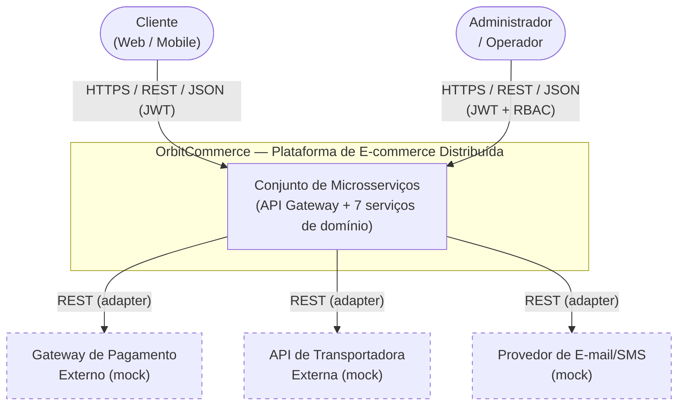
```mermaid
flowchart TB
    Customer(["Cliente<br/>(Web / Mobile)"])
    Admin(["Administrador<br/>/ Operador"])

    subgraph cluster_sys ["OrbitCommerce — Plataforma de E-commerce Distribuída"]
        Platform["Conjunto de Microsserviços<br/>(API Gateway + 7 serviços de domínio)"]
    end

    PaymentGW["Gateway de Pagamento<br/>Externo (mock)"]
    CarrierAPI["API de Transportadora<br/>Externa (mock)"]
    EmailProv["Provedor de E-mail/SMS<br/>(mock)"]

    style PaymentGW stroke-dasharray: 5 5
    style CarrierAPI stroke-dasharray: 5 5
    style EmailProv stroke-dasharray: 5 5

    Customer -->|"HTTPS / REST / JSON (JWT)"| Platform
    Admin -->|"HTTPS / REST / JSON<br/>(JWT + RBAC)"| Platform
    Platform -->|"REST (adapter)"| PaymentGW
    Platform -->|"REST (adapter)"| CarrierAPI
    Platform -->|"REST (adapter)"| EmailProv
```

> [!info]- Figura 2.1 — Diagrama de Contexto (Nível C1) O diagrama apresenta o sistema como uma caixa preta, evidenciando os atores humanos e os sistemas externos com os quais o OrbitCommerce se integra.

### 2.2 Diagrama de Containers

> No nível de containers, o sistema é decomposto em oito serviços deployáveis independentemente, um API Gateway como ponto único de entrada, dois backbones de mensageria com propósitos distintos, sete bancos de dados isolados (um por serviço, mais um cluster Redis compartilhado como cache) e a pilha de observabilidade.

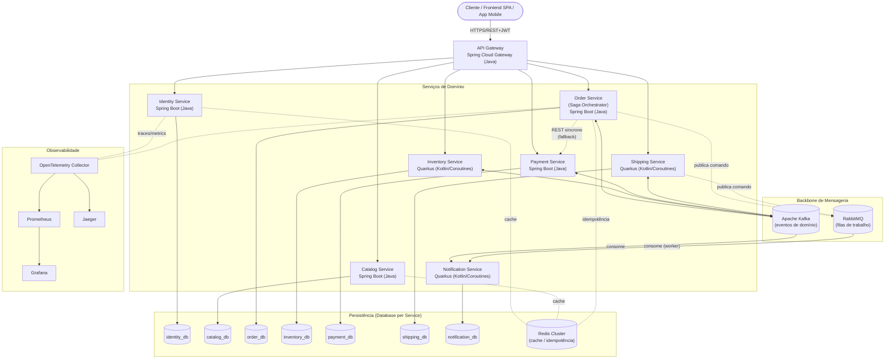
```mermaid
flowchart TB
    Client(["Cliente / Frontend SPA / App Mobile"])
    GW["API Gateway<br/>Spring Cloud Gateway (Java)"]

    subgraph cluster_core ["Serviços de Domínio"]
        IDN["Identity Service<br/>Spring Boot (Java)"]
        CAT["Catalog Service<br/>Spring Boot (Java)"]
        ORD["Order Service<br/>(Saga Orchestrator)<br/>Spring Boot (Java)"]
        INV["Inventory Service<br/>Quarkus (Kotlin/Coroutines)"]
        PAY["Payment Service<br/>Spring Boot (Java)"]
        SHP["Shipping Service<br/>Quarkus (Kotlin/Coroutines)"]
        NTF["Notification Service<br/>Quarkus (Kotlin/Coroutines)"]
    end

    subgraph cluster_msg ["Backbone de Mensageria"]
        KAFKA[("Apache Kafka<br/>(eventos de domínio)")]
        RABBIT[("RabbitMQ<br/>(filas de trabalho)")]
    end

    subgraph cluster_db ["Persistência (Database per Service)"]
        IDN_DB[("identity_db")]
        CAT_DB[("catalog_db")]
        ORD_DB[("order_db")]
        INV_DB[("inventory_db")]
        PAY_DB[("payment_db")]
        SHP_DB[("shipping_db")]
        NTF_DB[("notification_db")]
        REDIS[("Redis Cluster<br/>(cache / idempotência)")]
    end

    subgraph cluster_obs ["Observabilidade"]
        OTEL["OpenTelemetry Collector"]
        PROM["Prometheus"]
        GRAF["Grafana"]
        JAEGER["Jaeger"]
    end

    Client -->|HTTPS/REST+JWT| GW
    GW --> IDN
    GW --> CAT
    GW --> ORD
    GW --> INV
    GW --> PAY
    GW --> SHP

    ORD -.->|"REST síncrono<br/>(fallback)"| PAY

    ORD <--> KAFKA
    INV <--> KAFKA
    PAY <--> KAFKA
    SHP <--> KAFKA

    KAFKA -->|consome| NTF
    RABBIT -->|"consome (worker)"| NTF
    ORD -.->|publica comando| RABBIT
    SHP -.->|publica comando| RABBIT

    IDN --> IDN_DB
    CAT --> CAT_DB
    ORD --> ORD_DB
    INV --> INV_DB
    PAY --> PAY_DB
    SHP --> SHP_DB
    NTF --> NTF_DB

    IDN -.-|cache| REDIS
    CAT -.-|cache| REDIS
    ORD -.-|idempotência| REDIS

    IDN -.-|traces/metrics| OTEL
    ORD -.- OTEL
    OTEL --> PROM
    OTEL --> JAEGER
    PROM --> GRAF
```

> [!info]- Figura 2.2 — Diagrama de Containers (Nível C2) No nível de containers, o sistema é decomposto em oito serviços deployáveis independentemente, um API Gateway como ponto único de entrada, dois backbones de mensageria com propósitos distintos, sete bancos de dados isolados (um por serviço, mais um cluster Redis compartilhado como cache) e a pilha de observabilidade.

### 2.3 Padrões Arquiteturais Utilizados

|Padrão|Aplicação no Projeto|
|---|---|
|**Microservices**|Decomposição por subdomínio de negócio (DDD): Identity, Catalog, Order, Inventory, Payment, Shipping, Notification.|
|**Database per Service**|Cada serviço possui schema PostgreSQL próprio e não acessa diretamente o banco de outro serviço — toda integração ocorre via API ou evento.|
|**API Gateway**|Ponto único de entrada (Spring Cloud Gateway) responsável por roteamento, validação de JWT, rate limiting e agregação de headers de tracing.|
|**Saga (Orquestração)**|O Order Service atua como orquestrador central da transação distribuída de criação de pedido, coordenando Inventory, Payment e Shipping via eventos Kafka, com compensação explícita em caso de falha.|
|**Event-Driven Architecture / Pub-Sub**|Eventos de domínio (fatos imutáveis, ex.: `payment.authorized`) publicados em tópicos Kafka e consumidos por múltiplos interessados de forma desacoplada.|
|**Competing Consumers / Work Queue**|RabbitMQ distribui comandos de envio de notificação entre múltiplas instâncias do Notification Service, balanceando carga automaticamente.|
|**Cache-Aside**|Catalog Service consulta o Redis antes do PostgreSQL; em cache miss, popula o cache após a leitura no banco.|
|**Circuit Breaker / Retry / Timeout**|Resilience4j protege chamadas síncronas entre serviços (ex.: Order → Payment de fallback) contra cascata de falhas.|
|**Outbox Pattern**|Cada serviço que publica eventos grava o evento em uma tabela `outbox_events` na mesma transação da alteração de estado, com um processo assíncrono (poller/Debezium-like) publicando para o Kafka — evitando o problema de "dupla escrita" (_dual write_).|
|**Idempotent Receiver**|Consumidores de eventos verificam se a mensagem já foi processada (por `eventId`/chave de negócio) antes de aplicar efeitos colaterais, tornando o reprocessamento seguro.|
|**Backend for Frontend** (implícito no Gateway)|O API Gateway expõe uma superfície de API única e agregada ao cliente, escondendo a topologia interna de serviços.|

### 2.4 Estratégia de Comunicação entre Serviços

|Comunicação Síncrona (REST/JSON sobre HTTPS)|Comunicação Assíncrona (Kafka / RabbitMQ)|
|---|---|
|Usada para operações de leitura interativas iniciadas pelo cliente (ex.: consultar catálogo, consultar status do pedido).|Kafka é o meio primário de coordenação da saga: cada mudança relevante de estado de domínio gera um evento imutável, particionado por `orderId` (garante ordenação por pedido) e retido por 7 dias (permite replay/auditoria).|
|Usada pontualmente entre serviços apenas como fallback ou consulta de leitura (ex.: Order Service pode consultar Payment Service via REST para exibir detalhes de uma transação ao cliente), nunca como parte crítica do fluxo transacional da saga.|RabbitMQ é usado exclusivamente para o padrão _work queue_ de tarefas independentes e paralelizáveis (envio de notificações), com Dead Letter Exchange para mensagens que falham após 3 tentativas.|
|Protegida por timeout (2s), retry com backoff exponencial (3 tentativas) e circuit breaker (Resilience4j), com fallback definido para cada chamada.|Todas as mensagens carregam um envelope padrão com `eventId`, `eventType`, `occurredAt`, `traceId` e `payload` (ver [[#5 Catálogo de Contratos de Eventos e Mensagens|

### 2.5 Padrão Saga (Orquestração) — Visão Geral

A criação de um pedido é a transação distribuída mais crítica do sistema e envolve quatro serviços. O **Order Service** atua como orquestrador explícito (em vez de coreografia pura), mantendo uma máquina de estados (`SagaInstance` / `SagaStep`) que registra o progresso de cada etapa e decide a próxima ação — incluindo o disparo de compensações.

> [!note] Por que orquestração e não coreografia? Essa escolha de design foi feita para manter a lógica do processo de negócio centralizada, testável e observável em um único lugar, ao custo de um acoplamento lógico (não físico) do orquestrador ao vocabulário de eventos dos demais serviços.

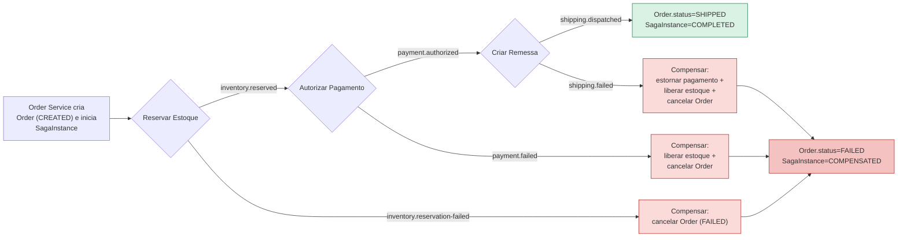
```mermaid
flowchart LR
    A["Order Service cria<br/>Order (CREATED) e inicia<br/>SagaInstance"]
    B{"Reservar Estoque"}
    C{"Autorizar Pagamento"}
    D{"Criar Remessa"}
    E["Order.status=SHIPPED<br/>SagaInstance=COMPLETED"]

    F1["Compensar:<br/>cancelar Order (FAILED)"]
    F2["Compensar:<br/>liberar estoque +<br/>cancelar Order"]
    F3["Compensar:<br/>estornar pagamento +<br/>liberar estoque +<br/>cancelar Order"]
    Z["Order.status=FAILED<br/>SagaInstance=COMPENSATED"]

    A --> B
    B -->|inventory.reserved| C
    B -->|inventory.reservation-failed| F1
    C -->|payment.authorized| D
    C -->|payment.failed| F2
    D -->|shipping.dispatched| E
    D -->|shipping.failed| F3

    F1 --> Z
    F2 --> Z
    F3 --> Z

    style E fill:#d9f2e3,stroke:#1a7f4b
    style F1 fill:#fbdada,stroke:#b3261e
    style F2 fill:#fbdada,stroke:#b3261e
    style F3 fill:#fbdada,stroke:#b3261e
    style Z fill:#f5c2c2,stroke:#b3261e
```

> [!info]- Figura 2.3 — Máquina de Estados da Saga de Criação de Pedido, com pontos de compensação

> [!warning] Regra de compensação Cada etapa da saga possui uma ação de compensação correspondente que desfaz seu efeito. Se a etapa N falhar, o orquestrador dispara as compensações das etapas 1..N-1 em ordem reversa. **Todas as ações de compensação são idempotentes** (podem ser executadas mais de uma vez sem efeito colateral adicional), tratando cenários de reentrega de mensagens.

---

## 3. Especificação dos Serviços

Esta seção documenta cada um dos oito serviços do OrbitCommerce. Para cada serviço são especificados: responsabilidades, stack tecnológica, modelo de classes de domínio, modelo de dados físico (DDL), contrato de API REST e contratos de eventos publicados/consumidos.

### 3.1 API Gateway

#### 3.1.1 Responsabilidades

- Ponto único de entrada HTTP/HTTPS para todos os clientes (SPA web, apps mobile, integrações B2B).
- Roteamento de requisições para os serviços de domínio com base no path (ex.: `/api/v1/orders/**` → Order Service).
- Validação de assinatura de JWT (JWKS obtido do Identity Service) antes de rotear — serviços internos confiam no header `X-User-Id`/`X-User-Roles` injetado pelo gateway.
- Rate limiting por cliente/IP (token bucket) para proteção contra abuso.
- Injeção e propagação de `traceparent` (W3C Trace Context) em todas as requisições roteadas.
- CORS centralizado e cabeçalhos de segurança (HSTS, X-Content-Type-Options, etc.).

#### 3.1.2 Stack Específica

|Item|Escolha|
|---|---|
|Framework|Spring Cloud Gateway Server MVC (`spring-cloud-gateway-server-webmvc`) — Java 25 com Virtual Threads <!-- [ATUALIZADO] era Java 21 --> (`spring.threads.virtual.enabled=true`)|
|Descoberta de serviços|DNS interno do Kubernetes/AWS Cloud Map (sem Eureka — cada serviço tem um Service/Fully Qualified Domain Name estável)|
|Rate limiting|Bucket4j com backend Redis (`bucket4j-redis`) — algoritmo token bucket, via filtro `rateLimit()` nativo do Gateway Server MVC|
|Persistência|Nenhuma (serviço stateless)|

#### 3.1.3 Tabela de Roteamento

|Path Predicate|Serviço de Destino|Autenticação Exigida|
|---|---|---|
|`/api/v1/auth/**`|identity-service|Não (endpoints públicos de login/registro)|
|`/api/v1/users/**`|identity-service|Sim|
|`/api/v1/categories/**`, `/api/v1/products/**`|catalog-service|Não para GET · Sim (`ROLE_ADMIN`) para POST/PUT/DELETE|
|`/api/v1/orders/**`|order-service|Sim|
|`/api/v1/inventory/**`|inventory-service|Sim (`ROLE_ADMIN`/`ROLE_SELLER`)|
|`/api/v1/payments/**`|payment-service|Sim|
|`/api/v1/shipments/**`|shipping-service|Sim|
|`/api/v1/notifications/**`|notification-service|Sim (`ROLE_ADMIN`, consulta de logs)|

#### 3.1.4 Rate Limiting

|Parâmetro|Valor Padrão|
|---|---|
|Capacidade do balde (burst)|40 requisições|
|Taxa de reposição|20 requisições/segundo por usuário autenticado (ou IP, se anônimo)|
|Resposta ao exceder limite|`429 Too Many Requests` com header `Retry-After`|

---

### 3.2 Identity Service

#### 3.2.1 Responsabilidades

- Cadastro, autenticação (login) e gestão de ciclo de vida de contas de usuário (ativação, bloqueio administrativo, exclusão/soft delete).
- Emissão e renovação de tokens JWT (access token de curta duração + refresh token opaco de longa duração).
- Gestão de papéis (roles) e permissões usadas para autorização (RBAC) em todos os demais serviços, incluindo hierarquia de papéis (`ROLE_ADMIN` alcança `ROLE_SELLER` e `ROLE_CUSTOMER`).
- Revogação de tokens em dois níveis: por sessão individual (logout de um dispositivo) e global (todas as sessões de um usuário simultaneamente — usado em bloqueio de conta e exclusão de conta). Ver [[#3.2.2 Stack Específica 2|3.2.2]] e [[#6 Segurança|6.1]] para detalhes do mecanismo.
- Autorização de operações sobre o próprio recurso (regra "dono ou administrador") para endpoints como exclusão de conta.
- Publicação do evento `user.registered`, consumido pelo Notification Service para o e-mail de boas-vindas.

#### 3.2.2 Stack Específica

|Item|Escolha|
|---|---|
|Framework|Spring Boot 4 (Spring Web MVC, Spring Security, Spring Data JPA)|
|Banco de dados|PostgreSQL 16 — schema `identity_db`|
|Cache|Redis — deny-list de tokens revogados em dois níveis: `blacklist:{jti}` (revoga um access token específico, usado no logout de um único dispositivo) e `revoke-all:{userId}` (revoga todos os access tokens de um usuário de uma vez, comparando o claim `iat` de cada token contra um carimbo de tempo — usado em bloqueio administrativo e exclusão de conta)|
|Hash de senha|BCrypt (custo 12)|
|Tokens|JWT assinado com RS256 (chave privada rotacionável); Refresh Token opaco (UUID) armazenado com hash SHA-256|

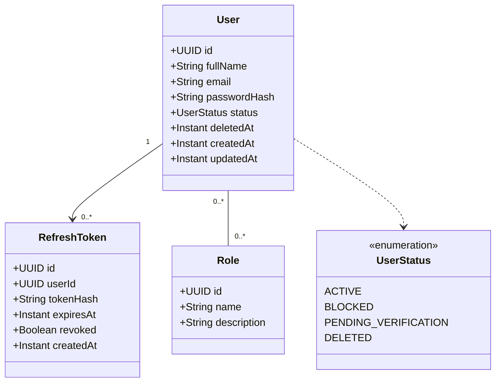
```mermaid
classDiagram
    direction TB

    class User {
        +UUID id
        +String fullName
        +String email
        +String passwordHash
        +UserStatus status
        +Instant deletedAt
        +Instant createdAt
        +Instant updatedAt
    }

    class Role {
        +UUID id
        +String name
        +String description
    }

    class RefreshToken {
        +UUID id
        +UUID userId
        +String tokenHash
        +Instant expiresAt
        +Boolean revoked
        +Instant createdAt
    }

    class UserStatus {
        <<enumeration>>
        ACTIVE
        BLOCKED
        PENDING_VERIFICATION
        DELETED
    }

    User "1" --> "0..*" RefreshToken
    User "0..*" -- "0..*" Role
    User ..> UserStatus

```

> [!info]- Figura 3.1 — Modelo de domínio do Identity Service

#### 3.2.4 Modelo de Dados (DDL — PostgreSQL)

```sql
CREATE TABLE roles (
    id UUID PRIMARY KEY DEFAULT gen_random_uuid(),
    name VARCHAR(50) NOT NULL UNIQUE, -- ROLE_CUSTOMER, ROLE_ADMIN, ROLE_SELLER
    description VARCHAR(255)
);

CREATE TABLE users (
    id UUID PRIMARY KEY DEFAULT gen_random_uuid(),
    full_name VARCHAR(150) NOT NULL,
    email VARCHAR(180) NOT NULL UNIQUE,
    password_hash VARCHAR(255) NOT NULL,
    status VARCHAR(30) NOT NULL DEFAULT 'PENDING_VERIFICATION',
    -- ACTIVE | BLOCKED | PENDING_VERIFICATION | DELETED
    deleted_at TIMESTAMPTZ,
    -- preenchido apenas quando status = DELETED (soft delete)
    created_at TIMESTAMPTZ NOT NULL DEFAULT now(),
    updated_at TIMESTAMPTZ NOT NULL DEFAULT now()
);
CREATE INDEX idx_users_email ON users(email);

CREATE TABLE user_roles (
    user_id UUID NOT NULL REFERENCES users(id) ON DELETE CASCADE,
    role_id UUID NOT NULL REFERENCES roles(id) ON DELETE CASCADE,
    PRIMARY KEY (user_id, role_id)
);

CREATE TABLE refresh_tokens (
    id UUID PRIMARY KEY DEFAULT gen_random_uuid(),
    user_id UUID NOT NULL REFERENCES users(id) ON DELETE CASCADE,
    token_hash VARCHAR(255) NOT NULL UNIQUE,
    expires_at TIMESTAMPTZ NOT NULL,
    revoked BOOLEAN NOT NULL DEFAULT false,
    created_at TIMESTAMPTZ NOT NULL DEFAULT now()
);
CREATE INDEX idx_refresh_tokens_user ON refresh_tokens(user_id);

-- Nota: exclusão de conta é soft delete. O registro de e-mail é anonimizado
-- (ex.: deleted-{id}@anon.orbitcommerce.local) para liberar o valor original
-- na constraint UNIQUE(email), sem quebrar a integridade referencial de
-- pedidos/pagamentos históricos que apontam para este user_id em outros
-- serviços (Order Service, Payment Service).

CREATE TABLE outbox_events (
    id UUID PRIMARY KEY DEFAULT gen_random_uuid(),
    aggregate_id UUID NOT NULL,
    event_type VARCHAR(100) NOT NULL,
    payload JSONB NOT NULL,
    created_at TIMESTAMPTZ NOT NULL DEFAULT now(),
    published BOOLEAN NOT NULL DEFAULT false
);
```

> [!warning] Pendência de design (não implementada) O fluxo de transição `PENDING_VERIFICATION → ACTIVE` depende de uma tabela `email_verification_tokens` (mesma estrutura de `refresh_tokens`: `id`, `user_id`, `token_hash`, `expires_at`, criada uma vez no registro) e do endpoint `GET /api/v1/auth/verify-email`, consumindo um evento novo `user.email-verification-requested` no Notification Service. Registrado aqui como decisão de arquitetura pendente de implementação.

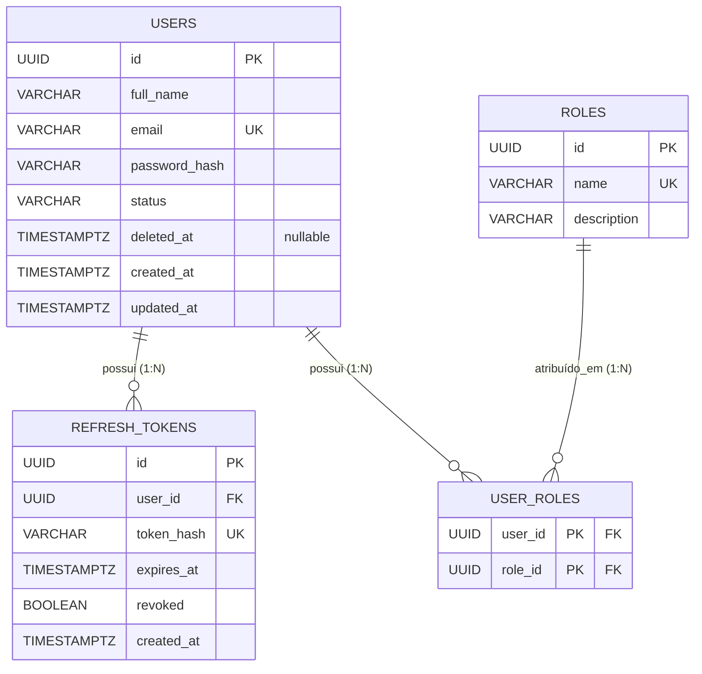
```mermaid
erDiagram 
	USERS ||--o{ REFRESH_TOKENS : "possui (1:N)" USERS ||--o{ USER_ROLES : "possui (1:N)" ROLES ||--o{ USER_ROLES : "atribuído_em (1:N)" USERS { UUID id PK VARCHAR full_name VARCHAR email UK VARCHAR password_hash VARCHAR status TIMESTAMPTZ deleted_at "nullable" TIMESTAMPTZ created_at TIMESTAMPTZ updated_at } ROLES { UUID id PK VARCHAR name UK VARCHAR description } USER_ROLES { UUID user_id PK "FK" UUID role_id PK "FK" } REFRESH_TOKENS { UUID id PK UUID user_id FK VARCHAR token_hash UK TIMESTAMPTZ expires_at BOOLEAN revoked TIMESTAMPTZ created_at }
```

> [!info]- Figura 3.2 — Diagrama ER do `identity_db`

#### 3.2.6 Especificação de API

**`POST /api/v1/auth/register`** Cria uma nova conta de usuário com papel padrão `ROLE_CUSTOMER` e status `PENDING_VERIFICATION`. Publica evento `user.registered`.

```json
// REQUEST BODY
{
  "fullName": "string (2-150 chars)",
  "email": "string (formato e-mail válido, único)",
  "password": "string (mín. 8 chars, 1 maiúscula, 1 número)"
}
```

```json
// RESPONSE 201 CREATED
{
  "id": "uuid",
  "fullName": "string",
  "email": "string",
  "status": "PENDING_VERIFICATION",
  "createdAt": "2026-07-22T10:00:00Z"
}
```

_Erros:_ `400` corpo inválido · `409` e-mail já cadastrado

**`POST /api/v1/auth/login`** Autentica um usuário e retorna par de tokens.

```json
// REQUEST BODY
{ "email": "string", "password": "string" }
```

```json
// RESPONSE 200 OK
{
  "accessToken": "string (JWT)",
  "refreshToken": "string (UUID opaco)",
  "tokenType": "Bearer",
  "expiresIn": 900
}
```

_Erros:_ `401` credenciais inválidas · `403` conta bloqueada

**`POST /api/v1/auth/refresh`** Gera um novo access token a partir de um refresh token válido e não revogado. Aplica rotação de refresh token (o token antigo é revogado).

```json
// REQUEST BODY
{ "refreshToken": "string" }
```

Resposta `200 OK` — mesmo formato do `/auth/login`. _Erros:_ `401` refresh token expirado, revogado ou inexistente

**`POST /api/v1/auth/logout`** Revoga o access token atual (deny-list `blacklist:{jti}` no Redis) e revoga o refresh token informado no PostgreSQL (`revoked = true`). Requer `Authorization: Bearer`. Afeta apenas a sessão/dispositivo atual — para derrubar todos os dispositivos de uma vez, ver `DELETE /api/v1/users/{id}` (revogação global).

```json
// REQUEST BODY
{ "refreshToken": "string" }
```

Resposta: `204 No Content`

**`GET /api/v1/users/me`** Retorna o perfil do usuário autenticado.

```json
// RESPONSE 200 OK
{
  "id": "uuid", "fullName": "string", "email": "string",
  "roles": ["ROLE_CUSTOMER"], "status": "ACTIVE", "createdAt": "date-time"
}
```

_Erros:_ `401` token ausente, inválido, expirado ou revogado (ver [[#6 Segurança|6.1]])

**`DELETE /api/v1/users/{id}`** Exclui (soft delete) a conta indicada. Autorização: o próprio dono da conta OU um usuário com `ROLE_ADMIN` — qualquer outro usuário autenticado recebe `403`. Anonimiza email e nome, marca `status = DELETED`, e aciona revogação global (`revoke-all:{userId}`) derrubando todas as sessões ativas daquela conta, em qualquer dispositivo, imediatamente.

Resposta: `204 No Content` _Erros:_ `401` não autenticado · `403` usuário autenticado não é o dono nem `ROLE_ADMIN` · `404` usuário não encontrado

> [!warning] Pendente (não implementado) `PATCH /api/v1/users/me` (atualização de nome) e `PATCH /api/v1/users/{id}/status` (bloqueio/desbloqueio administrativo de conta, restrito a `ROLE_ADMIN`, também deve acionar `revoke-all:{userId}`).

#### 3.2.7 Eventos

|Direção|Canal|Nome|Quando|
|---|---|---|---|
|Publica|Kafka — tópico `user.registered`|`UserRegisteredEvent`|Após confirmação da criação da conta (commit da transação, via Outbox Pattern).|
|Planejado (não implementado)|Kafka — tópico `user.email-verification-requested`|`UserEmailVerificationRequestedEvent`|Ver nota de pendência em [[#3.2.4 Modelo de Dados DDL — PostgreSQL|

---

### 3.3 Catalog Service

#### 3.3.1 Responsabilidades

- Manutenção do catálogo de categorias, produtos e variantes (SKUs) com seus preços vigentes, **um por moeda** <!-- [NOVO] a variante é identidade; o preço vive em `variant_prices` -->.
- Exposição de busca e listagem paginada de produtos para o frontend, com alta taxa de leitura.
- Cache-aside em Redis para reduzir latência e carga no banco em consultas de produto individual.
- Manutenção de histórico de preços **por moeda** para fins de auditoria e exibição de "preço anterior" <!-- [NOVO] o histórico são as linhas encerradas de `variant_prices` -->.
- Publicação de eventos de alteração de preço/estoque de catálogo consumidos por outros serviços (ex.: invalidação de cache de terceiros, motor de busca).

#### 3.3.2 Stack Específica

|Item|Escolha|
|---|---|
|Framework|Spring Boot 4 (Spring Web MVC, Spring Data JPA)|
|Banco de dados|PostgreSQL 16 — schema `catalog_db`|
|Cache|Redis — chave `product:{sku}:{currency}` <!-- [NOVO] chave por moeda -->, TTL 300s, invalidação ativa em updates (cadastro, atualização e encerramento de preço invalidam a chave da moeda afetada)|
|Busca (evolução futura)|Desenhado para admitir indexação em Elasticsearch/Amazon OpenSearch Service sem alterar o modelo de domínio|

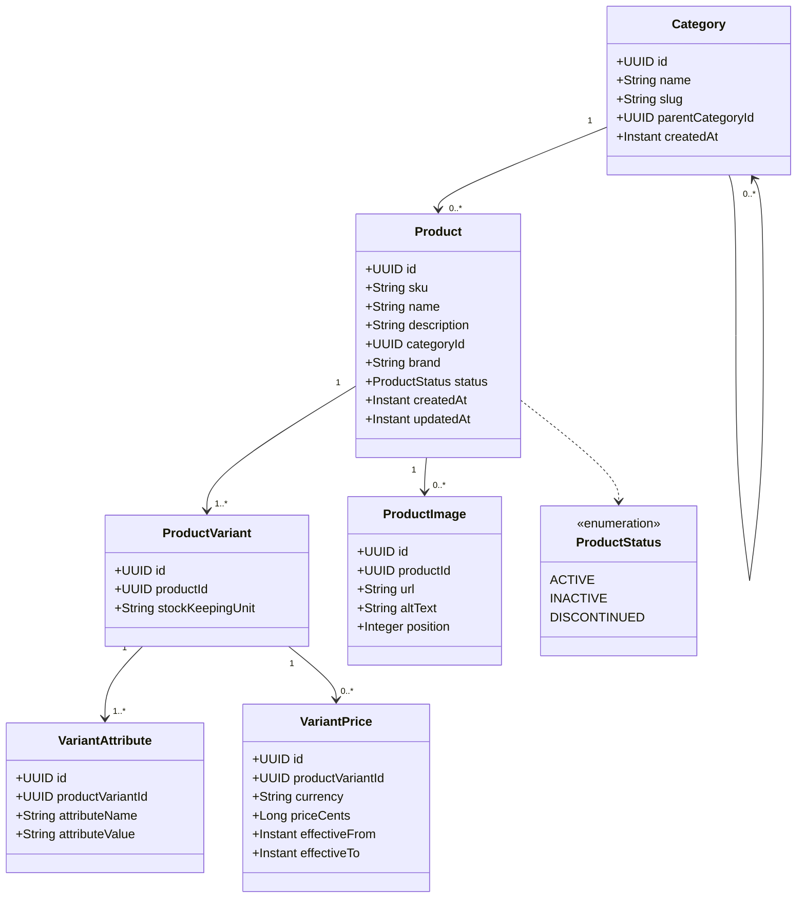
```mermaid
classDiagram
    direction TB

    class Category {
        +UUID id
        +String name
        +String slug
        +UUID parentCategoryId
        +Instant createdAt
    }

    class Product {
        +UUID id
        +String sku
        +String name
        +String description
        +UUID categoryId
        +String brand
        +ProductStatus status
        +Instant createdAt
        +Instant updatedAt
    }

    %% [ATUALIZADO] priceCents/currency removidos da variante — o preço agora vive em VariantPrice (um por moeda)
    class ProductVariant {
        +UUID id
        +UUID productId
        +String stockKeepingUnit
    }

    %% [NOVO] Opção A: tabela EAV normalizada — suporta N atributos simultâneos por variante (ex.: Tamanho 42 + Cor Azul na mesma variante)
    class VariantAttribute {
        +UUID id
        +UUID productVariantId
        +String attributeName
        +String attributeValue
    }

    class ProductImage {
        +UUID id
        +UUID productId
        +String url
        +String altText
        +Integer position
    }

    %% [NOVO] substitui PriceHistory: uma linha por variante+moeda+período; effectiveTo nulo = sem data de fim
    class VariantPrice {
        +UUID id
        +UUID productVariantId
        +String currency
        +Long priceCents
        +Instant effectiveFrom
        +Instant effectiveTo
    }

    class ProductStatus {
        <<enumeration>>
        ACTIVE
        INACTIVE
        DISCONTINUED
    }

    Category --> "0..*" Category
    Category "1" --> "0..*" Product
    Product "1" --> "1..*" ProductVariant
    Product "1" --> "0..*" ProductImage
    ProductVariant "1" --> "1..*" VariantAttribute
    ProductVariant "1" --> "0..*" VariantPrice
    Product ..> ProductStatus
```

> [!info]- Figura 3.3 — Modelo de domínio do Catalog Service

#### 3.3.4 Modelo de Dados (DDL — PostgreSQL)

```sql
CREATE TABLE categories (
    id UUID PRIMARY KEY DEFAULT gen_random_uuid(),
    name VARCHAR(120) NOT NULL,
    slug VARCHAR(140) NOT NULL UNIQUE,
    parent_category_id UUID REFERENCES categories(id),
    created_at TIMESTAMPTZ NOT NULL DEFAULT now()
);

CREATE TABLE products (
    id UUID PRIMARY KEY DEFAULT gen_random_uuid(),
    sku VARCHAR(40) NOT NULL UNIQUE,
    name VARCHAR(200) NOT NULL,
    description TEXT,
    category_id UUID NOT NULL REFERENCES categories(id),
    brand VARCHAR(100),
    status VARCHAR(20) NOT NULL DEFAULT 'ACTIVE', -- ACTIVE | INACTIVE | DISCONTINUED
    created_at TIMESTAMPTZ NOT NULL DEFAULT now(),
    updated_at TIMESTAMPTZ NOT NULL DEFAULT now()
);
CREATE INDEX idx_products_category ON products(category_id);

CREATE TABLE product_variants (
    id UUID PRIMARY KEY DEFAULT gen_random_uuid(),
    product_id UUID NOT NULL REFERENCES products(id) ON DELETE CASCADE,
    -- [ATUALIZADO] attribute_name/attribute_value removidos daqui — ver variant_attributes abaixo
    -- [ATUALIZADO] price_cents/currency removidos daqui — ver variant_prices abaixo
    stock_keeping_unit VARCHAR(40) NOT NULL UNIQUE
);

-- [NOVO] Opção A: EAV normalizado — 1 linha por atributo da variante, suporta N atributos
-- simultâneos (ex.: size=42 + color=azul na mesma variante), decisão registrada em ADR.
CREATE TABLE variant_attributes (
    id UUID PRIMARY KEY DEFAULT gen_random_uuid(),
    product_variant_id UUID NOT NULL REFERENCES product_variants(id) ON DELETE CASCADE,
    attribute_name VARCHAR(60) NOT NULL,   -- ex: "size", "color"
    attribute_value VARCHAR(60) NOT NULL,  -- ex: "42", "azul"
    UNIQUE (product_variant_id, attribute_name)
);

CREATE TABLE product_images (
    id UUID PRIMARY KEY DEFAULT gen_random_uuid(),
    product_id UUID NOT NULL REFERENCES products(id) ON DELETE CASCADE,
    url VARCHAR(500) NOT NULL,
    alt_text VARCHAR(150),
    position INT NOT NULL DEFAULT 0
);

-- [NOVO] necessário para usar UUID/CHAR em exclusion constraint com gist
CREATE EXTENSION IF NOT EXISTS btree_gist;

-- [NOVO] substitui price_history: 1 linha por variante + moeda + período de vigência.
-- Preço vigente = effective_from <= now() AND (effective_to IS NULL OR effective_to > now()).
-- Linhas com effective_to no passado formam o histórico. Sem linha vigente para uma moeda,
-- a variante não é vendida naquela moeda.
CREATE TABLE variant_prices (
    id UUID PRIMARY KEY DEFAULT gen_random_uuid(),
    product_variant_id UUID NOT NULL REFERENCES product_variants(id) ON DELETE CASCADE,
    currency CHAR(3) NOT NULL, -- ISO 4217 (CAD, USD, BRL...)
    price_cents BIGINT NOT NULL CHECK (price_cents >= 0),
    effective_from TIMESTAMPTZ NOT NULL,
    effective_to TIMESTAMPTZ, -- NULL = sem data de fim
    -- fim sempre posterior ao início
    CONSTRAINT ck_variant_prices_period
        CHECK (effective_to IS NULL OR effective_to > effective_from),
    -- impede períodos sobrepostos para a mesma variante e moeda (cobre encerramento agendado);
    -- o intervalo [) permite fechar a linha antiga e abrir a nova no mesmo instante
    CONSTRAINT ex_variant_prices_no_overlap
        EXCLUDE USING gist (
            product_variant_id WITH =,
            currency WITH =,
            tstzrange(effective_from, effective_to, '[)') WITH &&
        )
);
```

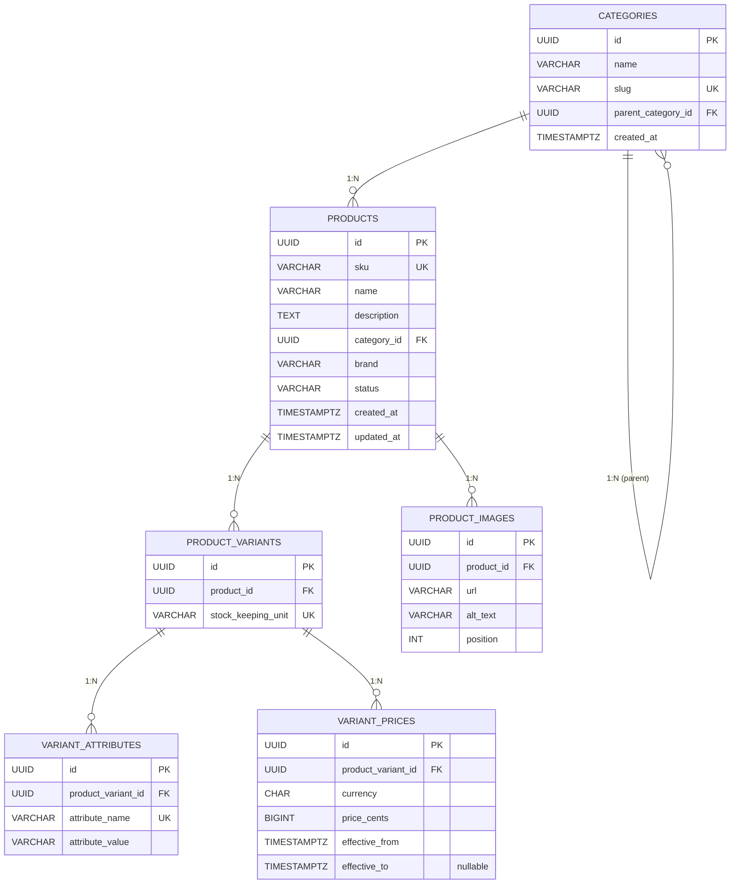
```mermaid
erDiagram
    CATEGORIES ||--o{ CATEGORIES : "1:N (parent)"
    CATEGORIES ||--o{ PRODUCTS : "1:N"
    PRODUCTS ||--o{ PRODUCT_VARIANTS : "1:N"
    PRODUCT_VARIANTS ||--o{ VARIANT_ATTRIBUTES : "1:N"
    PRODUCTS ||--o{ PRODUCT_IMAGES : "1:N"
    PRODUCT_VARIANTS ||--o{ VARIANT_PRICES : "1:N"

    CATEGORIES {
        UUID id PK
        VARCHAR name
        VARCHAR slug UK
        UUID parent_category_id FK
        TIMESTAMPTZ created_at
    }

    PRODUCTS {
        UUID id PK
        VARCHAR sku UK
        VARCHAR name
        TEXT description
        UUID category_id FK
        VARCHAR brand
        VARCHAR status
        TIMESTAMPTZ created_at
        TIMESTAMPTZ updated_at
    }

    PRODUCT_VARIANTS {
        UUID id PK
        UUID product_id FK
        VARCHAR stock_keeping_unit UK
    }

    VARIANT_ATTRIBUTES {
        UUID id PK
        UUID product_variant_id FK
        VARCHAR attribute_name UK
        VARCHAR attribute_value
    }

    PRODUCT_IMAGES {
        UUID id PK
        UUID product_id FK
        VARCHAR url
        VARCHAR alt_text
        INT position
    }

    VARIANT_PRICES {
        UUID id PK
        UUID product_variant_id FK
        CHAR currency
        BIGINT price_cents
        TIMESTAMPTZ effective_from
        TIMESTAMPTZ effective_to "nullable"
    }
```

> [!info]- Figura 3.4 — Diagrama ER do `catalog_db`

#### 3.3.6 Especificação de API

**`GET /api/v1/products`** — Lista produtos com paginação e filtros. _Query params:_ `page` (int, padrão 0) · `size` (int, padrão 20, máx. 100) · `categorySlug` (string, opcional) · `q` (string, busca textual, opcional) · `currency` (string ISO 4217, opcional, padrão `CAD`) <!-- [NOVO] -->

<!-- [NOVO] --> `priceCents`/`currency` na resposta são o menor preço vigente entre as variantes do produto na moeda solicitada; produtos sem preço vigente nessa moeda não aparecem na listagem.

```json
// RESPONSE 200 OK
{
  "content": [ { "id": "uuid", "sku": "string", "name": "string",
    "brand": "string", "priceCents": 12990, "currency": "CAD" } ],
  "page": 0, "size": 20, "totalElements": 134, "totalPages": 7
}
```

**`GET /api/v1/products/{sku}`** — Detalha um produto por SKU, com variantes, imagens e preço vigente na moeda solicitada (_query param_ `currency`, opcional, padrão `CAD`) <!-- [NOVO] -->. Consulta cache-aside (ver [[#4.4 Consulta de Catálogo com Cache Redis|Figura 4.4]]).

```json
// RESPONSE 200 OK
{
  "id": "uuid", "sku": "string", "name": "string", "description": "string",
  "brand": "string", "status": "ACTIVE",
  "category": { "id": "uuid", "name": "string", "slug": "string" },
  "variants": [ { "id": "uuid",
    "attributes": [ { "name": "size", "value": "M" }, { "name": "color", "value": "azul" } ],
    "price": { "priceCents": 12990, "currency": "CAD" }, "sku": "string" } ],
  "images": [ { "url": "string", "altText": "string", "position": 0 } ]
}
```

<!-- [NOVO] --> `variants[].price` é `null` quando a variante não tem preço vigente na moeda solicitada (não vendável nessa moeda).

_Erros:_ `404` produto não encontrado

**`POST /api/v1/products`** — Cria um novo produto com ao menos uma variante. Requer `ROLE_ADMIN` ou `ROLE_SELLER`.

```json
// REQUEST BODY
{
  "sku": "string", "name": "string", "description": "string",
  "categoryId": "uuid", "brand": "string",
  "variants": [ { "attributes": [ { "name": "size", "value": "M" }, { "name": "color", "value": "azul" } ],
    "prices": [ { "currency": "CAD", "priceCents": 12990 }, { "currency": "USD", "priceCents": 9990 } ],
    "stockKeepingUnit": "string" } ]
}
```

Resposta: `201 Created`, corpo igual ao GET por SKU _Erros:_ `400` validação · `403` sem permissão · `409` SKU duplicado

<!-- [NOVO] --> `prices[]` é opcional e aceita uma entrada por moeda (cada uma vira uma linha de `variant_prices` com `effective_from = now()`); moeda repetida ou fora do padrão ISO 4217 retorna `422`.

<!-- [ATUALIZADO] rota agora é por moeda; o body não carrega mais `currency` (vem do path) -->
**`PUT /api/v1/products/{sku}/variants/{variantId}/prices/{currency}`** — Cadastra ou atualiza o preço de uma variante em uma moeda. Sem preço vigente nessa moeda: cria a linha em `variant_prices` com `effective_from = now()`. Com preço vigente: fecha a linha vigente (`effective_to = now()`) e abre uma nova, na mesma transação. Valor igual ao vigente: sem alteração. Em todos os casos invalida a chave de cache `product:{sku}:{currency}`. Requer `ROLE_ADMIN` ou `ROLE_SELLER`.

```json
// REQUEST BODY
{ "priceCents": 11990 }
```

Resposta: `201 Created` (primeiro preço da moeda) ou `200 OK` (atualização) _Erros:_ `400` valor inválido · `403` sem permissão · `404` produto ou variante não encontrados · `422` moeda fora do padrão ISO 4217

<!-- [NOVO] -->
**`PATCH /api/v1/products/{sku}/variants/{variantId}/prices/{currency}`** — Encerra o preço vigente de uma moeda **sem registrar novo valor** (ex.: a variante deixa de ser vendida nessa moeda). Apenas define o `effective_to` da linha vigente; o histórico é preservado. Se `effectiveTo` for omitido, assume `now()`; uma data futura agenda o encerramento. Invalida a chave de cache `product:{sku}:{currency}`. Requer `ROLE_ADMIN` ou `ROLE_SELLER`.

```json
// REQUEST BODY
{ "effectiveTo": "2026-12-31T23:59:59Z" }
```

Resposta: `200 OK` _Erros:_ `403` sem permissão · `404` nenhum preço vigente nessa moeda · `409` preço já encerrado · `422` `effectiveTo` anterior ou igual ao `effective_from` da linha vigente

> [!note] Reativar uma moeda
> Para voltar a vender em uma moeda encerrada, basta um novo `PUT` na mesma rota: ele cria uma nova linha de `variant_prices`. O intervalo entre o encerramento e a nova linha permanece como lacuna no histórico.

#### 3.3.7 Eventos

|Direção|Canal|Nome|Quando|
|---|---|---|---|
|Publica|Kafka — tópico `catalog.price-changed`|`PriceChangedEvent`|Após atualização do preço de uma variante em uma moeda (`oldPriceCents` nulo quando é o primeiro preço daquela moeda). <!-- [ATUALIZADO] -->|
|Publica|Kafka — tópico `catalog.price-ended`|`PriceEndedEvent`|Após o encerramento do preço de uma variante em uma moeda, sem novo valor. <!-- [NOVO] -->|
|Publica|Kafka — tópico `catalog.product-status-changed`|`ProductStatusChangedEvent`|Quando um produto é descontinuado/reativado (afeta a possibilidade de criação de novos pedidos).|

---

### 3.4 Order Service (Saga Orchestrator)

#### 3.4.1 Responsabilidades

- Criar e manter o ciclo de vida do agregado `Order`, do estado `CREATED` até `DELIVERED`, `CANCELLED` ou `FAILED`.
- Orquestrar a saga distribuída de criação de pedido, coordenando Inventory, Payment e Shipping via eventos Kafka (ver Figuras 2.3, 4.2 e 4.3).
- Persistir o estado da saga (`SagaInstance`/`SagaStep`) de forma durável, permitindo retomada em caso de reinício do serviço.
- Disparar ações de compensação (liberar estoque, estornar pagamento) quando qualquer etapa falhar.
- Expor consulta de status e histórico do pedido ao cliente.

#### 3.4.2 Stack Específica

|Item|Escolha|
|---|---|
|Framework|Spring Boot 4 (Spring Web MVC, Spring Data JPA, Spring Kafka)|
|Banco de dados|PostgreSQL 16 — schema `order_db`|
|Controle de concorrência|Locking otimista via coluna `version` (`@Version` JPA) no agregado Order|
|Idempotência de escrita|Header `Idempotency-Key` na criação do pedido, checado em Redis (TTL 24h) antes de processar|
|Resiliência|Resilience4j (circuit breaker + retry) na chamada síncrona opcional a Payment Service|

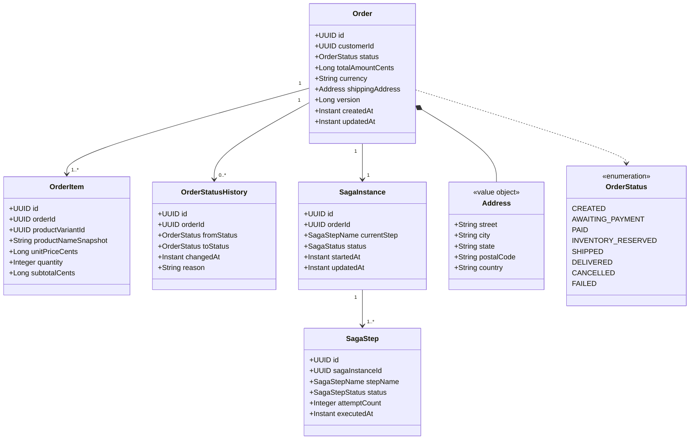
```mermaid
classDiagram
    direction TB

    class Order {
        +UUID id
        +UUID customerId
        +OrderStatus status
        +Long totalAmountCents
        +String currency
        +Address shippingAddress
        +Long version
        +Instant createdAt
        +Instant updatedAt
    }

    class OrderItem {
        +UUID id
        +UUID orderId
        +UUID productVariantId
        +String productNameSnapshot
        +Long unitPriceCents
        +Integer quantity
        +Long subtotalCents
    }

    class OrderStatusHistory {
        +UUID id
        +UUID orderId
        +OrderStatus fromStatus
        +OrderStatus toStatus
        +Instant changedAt
        +String reason
    }

    class SagaInstance {
        +UUID id
        +UUID orderId
        +SagaStepName currentStep
        +SagaStatus status
        +Instant startedAt
        +Instant updatedAt
    }

    class SagaStep {
        +UUID id
        +UUID sagaInstanceId
        +SagaStepName stepName
        +SagaStepStatus status
        +Integer attemptCount
        +Instant executedAt
    }

    class Address {
        <<value object>>
        +String street
        +String city
        +String state
        +String postalCode
        +String country
    }

    class OrderStatus {
        <<enumeration>>
        CREATED
        AWAITING_PAYMENT
        PAID
        INVENTORY_RESERVED
        SHIPPED
        DELIVERED
        CANCELLED
        FAILED
    }

    Order "1" --> "1..*" OrderItem
    Order "1" --> "0..*" OrderStatusHistory
    Order "1" --> "1" SagaInstance
    SagaInstance "1" --> "1..*" SagaStep
    Order *-- Address
    Order ..> OrderStatus
```

> [!info]- Figura 3.5 — Modelo de domínio do Order Service, incluindo o agregado de orquestração da Saga

#### 3.4.4 Modelo de Dados (DDL — PostgreSQL)

```sql
CREATE TABLE orders (
    id UUID PRIMARY KEY DEFAULT gen_random_uuid(),
    customer_id UUID NOT NULL,
    status VARCHAR(30) NOT NULL DEFAULT 'CREATED',
    -- CREATED | AWAITING_PAYMENT | PAID | INVENTORY_RESERVED
    -- SHIPPED | DELIVERED | CANCELLED | FAILED
    total_amount_cents BIGINT NOT NULL,
    currency CHAR(3) NOT NULL DEFAULT 'CAD',
    shipping_street VARCHAR(150) NOT NULL,
    shipping_city VARCHAR(80) NOT NULL,
    shipping_state VARCHAR(80),
    shipping_postal_code VARCHAR(10) NOT NULL,
    shipping_country CHAR(2) NOT NULL DEFAULT 'CA',
    version BIGINT NOT NULL DEFAULT 0,
    created_at TIMESTAMPTZ NOT NULL DEFAULT now(),
    updated_at TIMESTAMPTZ NOT NULL DEFAULT now()
);
CREATE INDEX idx_orders_customer ON orders(customer_id);
CREATE INDEX idx_orders_status ON orders(status);

CREATE TABLE order_items (
    id UUID PRIMARY KEY DEFAULT gen_random_uuid(),
    order_id UUID NOT NULL REFERENCES orders(id) ON DELETE CASCADE,
    product_variant_id UUID NOT NULL,
    product_name_snapshot VARCHAR(200) NOT NULL,
    unit_price_cents BIGINT NOT NULL,
    quantity INT NOT NULL CHECK (quantity > 0),
    subtotal_cents BIGINT NOT NULL
);

CREATE TABLE order_status_history (
    id UUID PRIMARY KEY DEFAULT gen_random_uuid(),
    order_id UUID NOT NULL REFERENCES orders(id) ON DELETE CASCADE,
    from_status VARCHAR(30),
    to_status VARCHAR(30) NOT NULL,
    changed_at TIMESTAMPTZ NOT NULL DEFAULT now(),
    reason VARCHAR(255)
);

CREATE TABLE saga_instances (
    id UUID PRIMARY KEY DEFAULT gen_random_uuid(),
    order_id UUID NOT NULL UNIQUE REFERENCES orders(id) ON DELETE CASCADE,
    current_step VARCHAR(40) NOT NULL, -- RESERVE_INVENTORY | AUTHORIZE_PAYMENT | CREATE_SHIPMENT
    status VARCHAR(20) NOT NULL DEFAULT 'IN_PROGRESS',
    -- IN_PROGRESS | COMPLETED | COMPENSATING | COMPENSATED | FAILED
    started_at TIMESTAMPTZ NOT NULL DEFAULT now(),
    updated_at TIMESTAMPTZ NOT NULL DEFAULT now()
);

CREATE TABLE saga_steps (
    id UUID PRIMARY KEY DEFAULT gen_random_uuid(),
    saga_instance_id UUID NOT NULL REFERENCES saga_instances(id) ON DELETE CASCADE,
    step_name VARCHAR(40) NOT NULL,
    status VARCHAR(20) NOT NULL DEFAULT 'PENDING',
    -- PENDING | SUCCESS | FAILED | COMPENSATED
    attempt_count INT NOT NULL DEFAULT 0,
    executed_at TIMESTAMPTZ
);

CREATE TABLE outbox_events (
    id UUID PRIMARY KEY DEFAULT gen_random_uuid(),
    aggregate_id UUID NOT NULL,
    event_type VARCHAR(100) NOT NULL,
    payload JSONB NOT NULL,
    created_at TIMESTAMPTZ NOT NULL DEFAULT now(),
    published BOOLEAN NOT NULL DEFAULT false
);
```

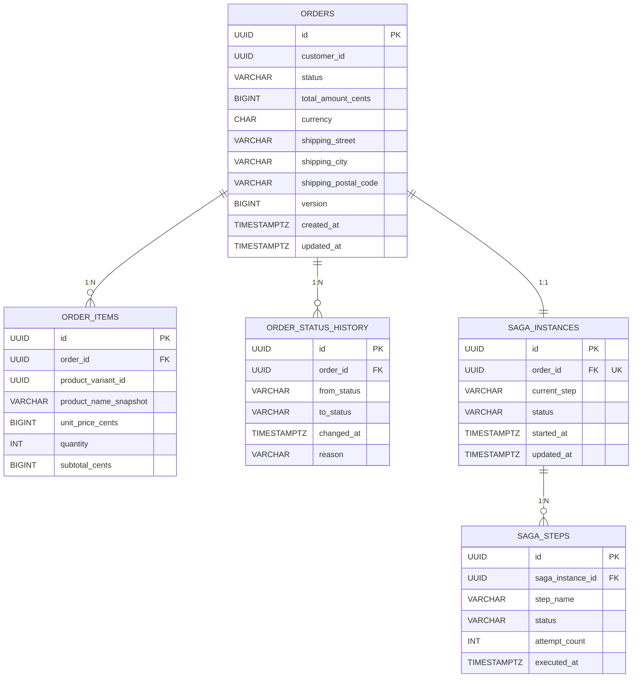
```mermaid
erDiagram
    ORDERS ||--o{ ORDER_ITEMS : "1:N"
    ORDERS ||--o{ ORDER_STATUS_HISTORY : "1:N"
    ORDERS ||--|| SAGA_INSTANCES : "1:1"
    SAGA_INSTANCES ||--o{ SAGA_STEPS : "1:N"

    ORDERS {
        UUID id PK
        UUID customer_id
        VARCHAR status
        BIGINT total_amount_cents
        CHAR currency
        VARCHAR shipping_street
        VARCHAR shipping_city
        VARCHAR shipping_postal_code
        BIGINT version
        TIMESTAMPTZ created_at
        TIMESTAMPTZ updated_at
    }

    ORDER_ITEMS {
        UUID id PK
        UUID order_id FK
        UUID product_variant_id
        VARCHAR product_name_snapshot
        BIGINT unit_price_cents
        INT quantity
        BIGINT subtotal_cents
    }

    ORDER_STATUS_HISTORY {
        UUID id PK
        UUID order_id FK
        VARCHAR from_status
        VARCHAR to_status
        TIMESTAMPTZ changed_at
        VARCHAR reason
    }

    SAGA_INSTANCES {
        UUID id PK
        UUID order_id FK "UK"
        VARCHAR current_step
        VARCHAR status
        TIMESTAMPTZ started_at
        TIMESTAMPTZ updated_at
    }

    SAGA_STEPS {
        UUID id PK
        UUID saga_instance_id FK
        VARCHAR step_name
        VARCHAR status
        INT attempt_count
        TIMESTAMPTZ executed_at
    }
```

> [!info]- Figura 3.6 — Diagrama ER do `order_db`

#### 3.4.6 Máquina de Estados do Pedido

|De|Para|Gatilho|
|---|---|---|
|—|`CREATED`|`POST /orders` bem-sucedido|
|`CREATED`|`INVENTORY_RESERVED`|evento `inventory.reserved`|
|`INVENTORY_RESERVED`|`PAID`|evento `payment.authorized`|
|`PAID`|`SHIPPED`|evento `shipping.dispatched`|
|`SHIPPED`|`DELIVERED`|evento `shipping.delivered`|
|`CREATED` / `INVENTORY_RESERVED` / `PAID`|`FAILED`|qualquer falha em etapa da saga + compensações concluídas|

#### 3.4.7 Especificação de API

**`POST /api/v1/orders`** — Cria um novo pedido e inicia a saga de processamento. Requer header `Idempotency-Key`.

```json
// REQUEST BODY
{
  "currency": "CAD", // [NOVO] moeda em que o cliente quer pagar; precisa ter preço vigente para todos os itens
  "items": [ { "productVariantId": "uuid", "quantity": 2 } ],
  "shippingAddress": {
    "street": "string", "city": "string", "state": "string",
    "postalCode": "string", "country": "CA"
  }
}
```

```json
// RESPONSE 201 CREATED
{ "id": "uuid", "status": "CREATED", "totalAmountCents": 25980,
  "currency": "CAD", "createdAt": "date-time" }
```

_Erros:_ `400` itens inválidos/vazios · `401` não autenticado · `409` Idempotency-Key já processada com corpo diferente · `422` algum item não tem preço vigente na moeda solicitada <!-- [NOVO] -->

**`GET /api/v1/orders/{orderId}`** — Consulta detalhes e status atual de um pedido, incluindo itens e histórico de status.

```json
// RESPONSE 200 OK
{
  "id": "uuid", "status": "SHIPPED", "totalAmountCents": 25980, "currency": "CAD",
  "items": [ { "productVariantId": "uuid", "productNameSnapshot": "string",
    "quantity": 2, "unitPriceCents": 12990, "subtotalCents": 25980 } ],
  "statusHistory": [ { "fromStatus": "CREATED", "toStatus": "INVENTORY_RESERVED",
    "changedAt": "date-time" } ]
}
```

_Erros:_ `403` pedido pertence a outro cliente · `404` não encontrado

**`GET /api/v1/orders`** — Lista os pedidos do usuário autenticado, paginado e ordenado por data decrescente. _Query params:_ `page`, `size`, `status` (filtro opcional) Resposta: `200 OK` — estrutura de página, análoga à listagem de produtos

**`POST /api/v1/orders/{orderId}/cancel`** — Solicita o cancelamento de um pedido ainda não enviado. Se a saga estiver em andamento, agenda a compensação assim que a etapa corrente concluir. Resposta: `202 Accepted` (cancelamento assíncrono) · `409` pedido já enviado/entregue não pode ser cancelado por este endpoint

#### 3.4.8 Eventos

|Direção|Canal|Nome|Quando|
|---|---|---|---|
|Publica|Kafka — `order.created`|`OrderCreatedEvent`|Imediatamente após persistir o pedido (dispara a saga).|
|Publica|Kafka — `payment.requested`|`PaymentRequestedEvent`|Após confirmar reserva de estoque.|
|Publica|Kafka — `shipping.requested`|`ShippingRequestedEvent`|Após pagamento autorizado.|
|Publica|Kafka — `inventory.release`|`ReleaseInventoryCommand`|Compensação: pagamento ou remessa falharam.|
|Publica|Kafka — `order.cancelled`|`OrderCancelledEvent`|Ao final de uma compensação bem-sucedida.|
|Consome|Kafka — `inventory.reserved` / `inventory.reservation-failed`|—|Avança ou aborta a saga na etapa de estoque.|
|Consome|Kafka — `payment.authorized` / `payment.failed`|—|Avança ou aborta a saga na etapa de pagamento.|
|Consome|Kafka — `shipping.dispatched` / `shipping.failed`|—|Conclui a saga ou dispara compensação total.|

---

### 3.5 Inventory Service

#### 3.5.1 Responsabilidades

- Manter a quantidade disponível e reservada de cada variante de produto por armazém (_warehouse_).
- Reservar estoque de forma atômica ao receber um pedido (etapa 1 da saga) e confirmar/liberar a reserva conforme o desfecho da saga.
- Expirar automaticamente reservas não confirmadas após um TTL configurável, evitando "estoque fantasma".
- Consumir eventos em alta concorrência com Kotlin Coroutines para throughput elevado em picos de demanda (ex.: promoções).

#### 3.5.2 Stack Específica

|Item|Escolha|
|---|---|
|Framework|Quarkus (Kotlin) — REST reativo (RESTEasy Reactive) + Kotlin Coroutines|
|Banco de dados|PostgreSQL 16 — schema `inventory_db`, acesso via Hibernate Reactive with Panache|
|Consumo de eventos|SmallRye Reactive Messaging (Kafka connector), consumidores `suspend fun`|
|Controle de concorrência|`SELECT ... FOR UPDATE` na linha de `stock_items` durante a reserva, garantindo atomicidade sob concorrência|

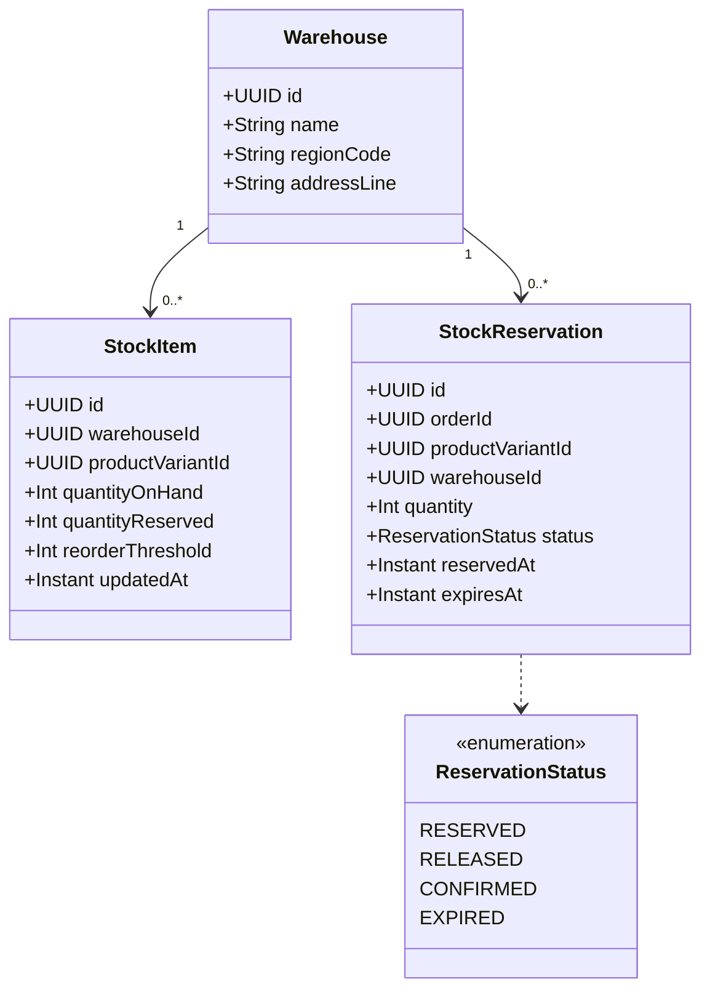
```mermaid
classDiagram
    direction TB

    class Warehouse {
        +UUID id
        +String name
        +String regionCode
        +String addressLine
    }

    class StockItem {
        +UUID id
        +UUID warehouseId
        +UUID productVariantId
        +Int quantityOnHand
        +Int quantityReserved
        +Int reorderThreshold
        +Instant updatedAt
    }

    class StockReservation {
        +UUID id
        +UUID orderId
        +UUID productVariantId
        +UUID warehouseId
        +Int quantity
        +ReservationStatus status
        +Instant reservedAt
        +Instant expiresAt
    }

    class ReservationStatus {
        <<enumeration>>
        RESERVED
        RELEASED
        CONFIRMED
        EXPIRED
    }

    Warehouse "1" --> "0..*" StockItem
    Warehouse "1" --> "0..*" StockReservation
    StockReservation ..> ReservationStatus
```

> [!info]- Figura 3.7 — Modelo de domínio do Inventory Service

#### 3.5.4 Modelo de Dados (DDL — PostgreSQL)

```sql
CREATE TABLE warehouses (
    id UUID PRIMARY KEY DEFAULT gen_random_uuid(),
    name VARCHAR(120) NOT NULL,
    region_code VARCHAR(10) NOT NULL,
    address_line VARCHAR(255)
);

CREATE TABLE stock_items (
    id UUID PRIMARY KEY DEFAULT gen_random_uuid(),
    warehouse_id UUID NOT NULL REFERENCES warehouses(id),
    product_variant_id UUID NOT NULL,
    quantity_on_hand INT NOT NULL DEFAULT 0 CHECK (quantity_on_hand >= 0),
    quantity_reserved INT NOT NULL DEFAULT 0 CHECK (quantity_reserved >= 0),
    reorder_threshold INT NOT NULL DEFAULT 10,
    updated_at TIMESTAMPTZ NOT NULL DEFAULT now(),
    UNIQUE (warehouse_id, product_variant_id)
);

CREATE TABLE stock_reservations (
    id UUID PRIMARY KEY DEFAULT gen_random_uuid(),
    order_id UUID NOT NULL,
    product_variant_id UUID NOT NULL,
    warehouse_id UUID NOT NULL REFERENCES warehouses(id),
    quantity INT NOT NULL CHECK (quantity > 0),
    status VARCHAR(20) NOT NULL DEFAULT 'RESERVED',
    -- RESERVED | RELEASED | CONFIRMED | EXPIRED
    reserved_at TIMESTAMPTZ NOT NULL DEFAULT now(),
    expires_at TIMESTAMPTZ NOT NULL
);
CREATE INDEX idx_stock_reservations_order ON stock_reservations(order_id);
```

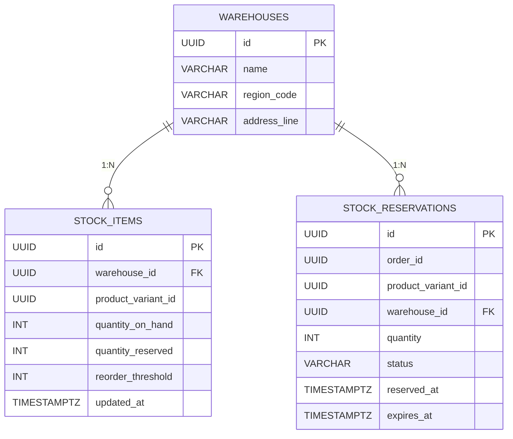
```mermaid
erDiagram
    WAREHOUSES ||--o{ STOCK_ITEMS : "1:N"
    WAREHOUSES ||--o{ STOCK_RESERVATIONS : "1:N"

    WAREHOUSES {
        UUID id PK
        VARCHAR name
        VARCHAR region_code
        VARCHAR address_line
    }

    STOCK_ITEMS {
        UUID id PK
        UUID warehouse_id FK
        UUID product_variant_id
        INT quantity_on_hand
        INT quantity_reserved
        INT reorder_threshold
        TIMESTAMPTZ updated_at
    }

    STOCK_RESERVATIONS {
        UUID id PK
        UUID order_id
        UUID product_variant_id
        UUID warehouse_id FK
        INT quantity
        VARCHAR status
        TIMESTAMPTZ reserved_at
        TIMESTAMPTZ expires_at
    }
```

> [!info]- Figura 3.8 — Diagrama ER do `inventory_db`

#### 3.5.6 Especificação de API

**`GET /api/v1/inventory/{productVariantId}`** — Consulta a disponibilidade agregada (soma entre armazéns) de uma variante.

```json
// RESPONSE 200 OK
{ "productVariantId": "uuid", "quantityOnHand": 340, "quantityReserved": 28,
  "quantityAvailable": 312 }
```

**`POST /api/v1/inventory/{productVariantId}/adjust`** — Ajuste manual de estoque (entrada de mercadoria, correção de inventário). Requer `ROLE_ADMIN`.

```json
// REQUEST BODY
{ "warehouseId": "uuid", "delta": 50, "reason": "string" }
```

Resposta: `200 OK` com o novo saldo

> [!note] Nota de design Não existe endpoint público de "reservar estoque" — essa operação é exclusivamente reativa a eventos Kafka (`order.created`), reforçando que a saga é a única forma de reserva, evitando reservas órfãs criadas fora do fluxo transacional.

#### 3.5.7 Eventos

|Direção|Canal|Nome|Quando|
|---|---|---|---|
|Consome|Kafka — `order.created`|—|Dispara a tentativa de reserva de estoque para todos os itens do pedido.|
|Consome|Kafka — `inventory.release`|—|Comando de compensação: libera reserva associada ao `orderId`.|
|Publica|Kafka — `inventory.reserved`|`InventoryReservedEvent`|Todos os itens do pedido foram reservados com sucesso.|
|Publica|Kafka — `inventory.reservation-failed`|`InventoryReservationFailedEvent`|Estoque insuficiente para ao menos um item.|
|Publica|Kafka — `inventory.released`|`InventoryReleasedEvent`|Confirmação de que a compensação foi aplicada.|

---

### 3.6 Payment Service

#### 3.6.1 Responsabilidades

- Autorizar e capturar pagamentos junto a um gateway externo (adaptador mock com contrato compatível com provedores reais como Stripe).
- Registrar todas as transações (autorização, captura, estorno) para fins de auditoria e reconciliação financeira.
- Processar solicitações de estorno (_refund_) parciais ou totais.
- Garantir que cada `orderId` tenha no máximo um pagamento associado (idempotência por chave de negócio).

#### 3.6.2 Stack Específica

|Item|Escolha|
|---|---|
|Framework|Spring Boot 4 (Spring Web MVC, Spring Data JPA, Spring Kafka)|
|Banco de dados|PostgreSQL 16 — schema `payment_db`|
|Integração externa|Adapter HTTP para gateway mock, protegido por Resilience4j (circuit breaker, retry, timeout)|
|Idempotência|Constraint `UNIQUE(order_id)` na tabela `payments` + verificação prévia antes de chamar o gateway|

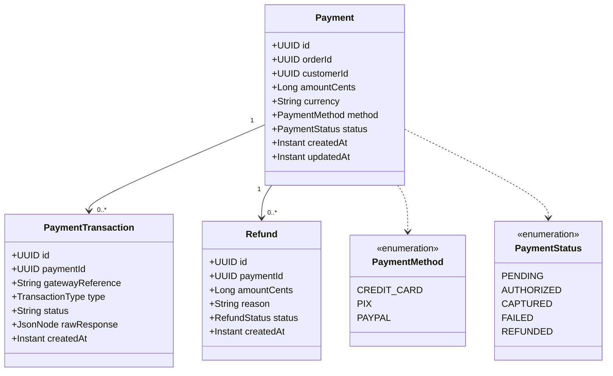
```mermaid
classDiagram
    direction TB

    class Payment {
        +UUID id
        +UUID orderId
        +UUID customerId
        +Long amountCents
        +String currency
        +PaymentMethod method
        +PaymentStatus status
        +Instant createdAt
        +Instant updatedAt
    }

    class PaymentTransaction {
        +UUID id
        +UUID paymentId
        +String gatewayReference
        +TransactionType type
        +String status
        +JsonNode rawResponse
        +Instant createdAt
    }

    class Refund {
        +UUID id
        +UUID paymentId
        +Long amountCents
        +String reason
        +RefundStatus status
        +Instant createdAt
    }

    class PaymentMethod {
        <<enumeration>>
        CREDIT_CARD
        PIX
        PAYPAL
    }

    class PaymentStatus {
        <<enumeration>>
        PENDING
        AUTHORIZED
        CAPTURED
        FAILED
        REFUNDED
    }

    Payment "1" --> "0..*" PaymentTransaction
    Payment "1" --> "0..*" Refund
    Payment ..> PaymentMethod
    Payment ..> PaymentStatus

```

> [!info]- Figura 3.9 — Modelo de domínio do Payment Service

#### 3.6.4 Modelo de Dados (DDL — PostgreSQL)

```sql
CREATE TABLE payments (
    id UUID PRIMARY KEY DEFAULT gen_random_uuid(),
    order_id UUID NOT NULL UNIQUE,
    customer_id UUID NOT NULL,
    amount_cents BIGINT NOT NULL,
    currency CHAR(3) NOT NULL DEFAULT 'CAD',
    method VARCHAR(20) NOT NULL, -- CREDIT_CARD | PIX | PAYPAL
    status VARCHAR(20) NOT NULL DEFAULT 'PENDING',
    -- PENDING | AUTHORIZED | CAPTURED | FAILED | REFUNDED
    created_at TIMESTAMPTZ NOT NULL DEFAULT now(),
    updated_at TIMESTAMPTZ NOT NULL DEFAULT now()
);

CREATE TABLE payment_transactions (
    id UUID PRIMARY KEY DEFAULT gen_random_uuid(),
    payment_id UUID NOT NULL REFERENCES payments(id) ON DELETE CASCADE,
    gateway_reference VARCHAR(100),
    type VARCHAR(20) NOT NULL, -- AUTHORIZATION | CAPTURE | VOID
    status VARCHAR(30) NOT NULL,
    raw_response JSONB,
    created_at TIMESTAMPTZ NOT NULL DEFAULT now()
);

CREATE TABLE refunds (
    id UUID PRIMARY KEY DEFAULT gen_random_uuid(),
    payment_id UUID NOT NULL REFERENCES payments(id) ON DELETE CASCADE,
    amount_cents BIGINT NOT NULL,
    reason VARCHAR(255),
    status VARCHAR(20) NOT NULL DEFAULT 'REQUESTED', -- REQUESTED | PROCESSED | FAILED
    created_at TIMESTAMPTZ NOT NULL DEFAULT now()
);
```

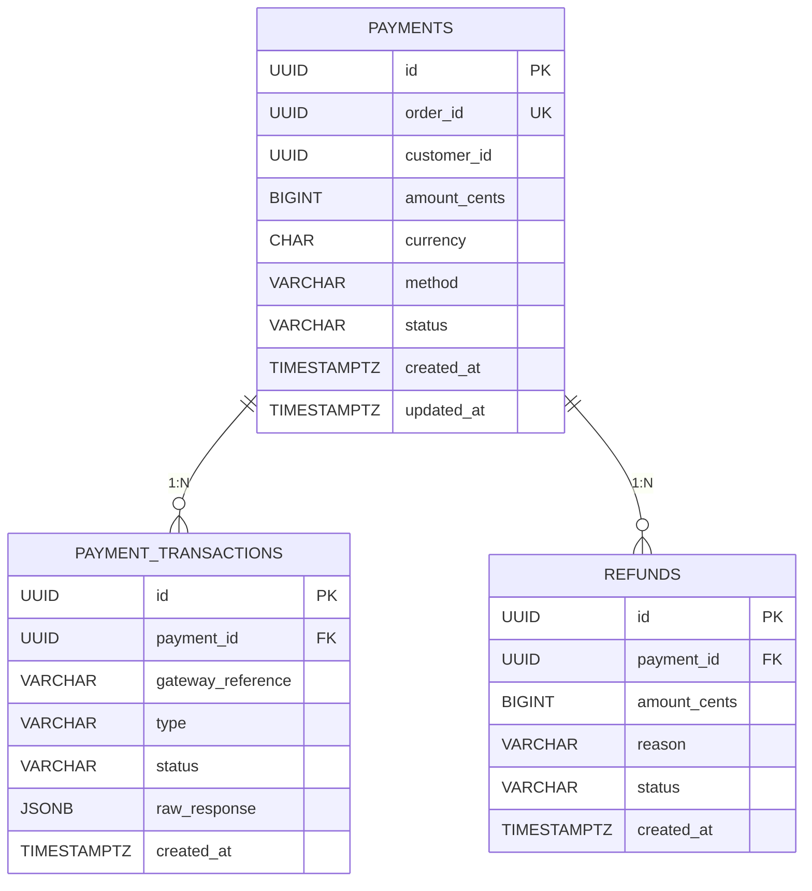
```mermaid
erDiagram
    PAYMENTS ||--o{ PAYMENT_TRANSACTIONS : "1:N"
    PAYMENTS ||--o{ REFUNDS : "1:N"

    PAYMENTS {
        UUID id PK
        UUID order_id UK
        UUID customer_id
        BIGINT amount_cents
        CHAR currency
        VARCHAR method
        VARCHAR status
        TIMESTAMPTZ created_at
        TIMESTAMPTZ updated_at
    }

    PAYMENT_TRANSACTIONS {
        UUID id PK
        UUID payment_id FK
        VARCHAR gateway_reference
        VARCHAR type
        VARCHAR status
        JSONB raw_response
        TIMESTAMPTZ created_at
    }

    REFUNDS {
        UUID id PK
        UUID payment_id FK
        BIGINT amount_cents
        VARCHAR reason
        VARCHAR status
        TIMESTAMPTZ created_at
    }
```

> [!info]- Figura 3.10 — Diagrama ER do `payment_db`

#### 3.6.6 Especificação de API

**`GET /api/v1/payments/{orderId}`** — Consulta o status de pagamento de um pedido.

```json
// RESPONSE 200 OK
{ "orderId": "uuid", "status": "CAPTURED", "amountCents": 25980,
  "currency": "CAD", "method": "CREDIT_CARD", "updatedAt": "date-time" }
```

_Erros:_ `404` nenhum pagamento associado ao pedido

**`POST /api/v1/payments/{orderId}/refund`** — Solicita estorno total ou parcial de um pagamento já capturado. Requer `ROLE_ADMIN` ou ser o próprio cliente dono do pedido.

```json
// REQUEST BODY
{ "amountCents": 25980, "reason": "string" }
```

Resposta: `202 Accepted` (processamento assíncrono junto ao gateway) _Erros:_ `409` valor de estorno excede o valor capturado · `422` pagamento não está em estado capturável de estorno

#### 3.6.7 Eventos

|Direção|Canal|Nome|Quando|
|---|---|---|---|
|Consome|Kafka — `payment.requested`|—|Dispara autorização junto ao gateway externo.|
|Publica|Kafka — `payment.authorized`|`PaymentAuthorizedEvent`|Gateway aprovou a transação.|
|Publica|Kafka — `payment.failed`|`PaymentFailedEvent`|Gateway recusou ou timeout/erro de comunicação.|
|Publica|Kafka — `payment.refunded`|`PaymentRefundedEvent`|Estorno processado com sucesso; consumido pelo Notification Service.|

---

### 3.7 Shipping Service

#### 3.7.1 Responsabilidades

- Criar remessas (_shipments_) a partir de pedidos pagos, selecionando/atribuindo uma transportadora (_carrier_).
- Registrar e expor o histórico de eventos de rastreamento (_tracking_) de cada remessa.
- Integrar-se com API mock de transportadora para geração de código de rastreio e cálculo de previsão de entrega.
- Publicar comandos de notificação (via RabbitMQ) a cada mudança relevante de status de entrega.

#### 3.7.2 Stack Específica

|Item|Escolha|
|---|---|
|Framework|Quarkus (Kotlin) — REST reativo + Kotlin Coroutines|
|Banco de dados|PostgreSQL 16 — schema `shipping_db`|
|Integração externa|Adapter HTTP assíncrono (Coroutines + Ktor client) para API mock de transportadora|
|Mensageria|Consome Kafka (`shipping.requested`); publica Kafka (eventos de domínio) e RabbitMQ (comando de notificação)|

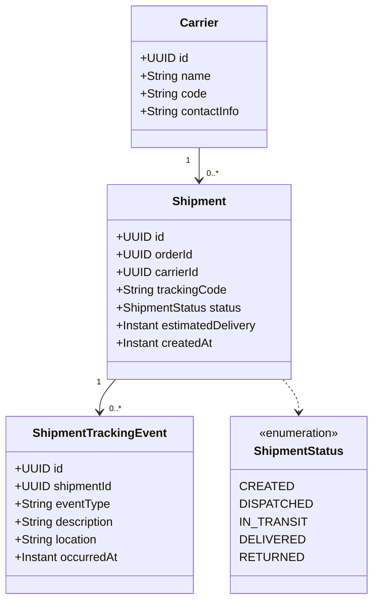
```mermaid
classDiagram
    direction TB

    class Carrier {
        +UUID id
        +String name
        +String code
        +String contactInfo
    }

    class Shipment {
        +UUID id
        +UUID orderId
        +UUID carrierId
        +String trackingCode
        +ShipmentStatus status
        +Instant estimatedDelivery
        +Instant createdAt
    }

    class ShipmentTrackingEvent {
        +UUID id
        +UUID shipmentId
        +String eventType
        +String description
        +String location
        +Instant occurredAt
    }

    class ShipmentStatus {
        <<enumeration>>
        CREATED
        DISPATCHED
        IN_TRANSIT
        DELIVERED
        RETURNED
    }

    Carrier "1" --> "0..*" Shipment
    Shipment "1" --> "0..*" ShipmentTrackingEvent
    Shipment ..> ShipmentStatus
```

> [!info]- Figura 3.11 — Modelo de domínio do Shipping Service

#### 3.7.4 Modelo de Dados (DDL — PostgreSQL)

```sql
CREATE TABLE carriers (
    id UUID PRIMARY KEY DEFAULT gen_random_uuid(),
    name VARCHAR(120) NOT NULL,
    code VARCHAR(20) NOT NULL UNIQUE,
    contact_info VARCHAR(255)
);

CREATE TABLE shipments (
    id UUID PRIMARY KEY DEFAULT gen_random_uuid(),
    order_id UUID NOT NULL UNIQUE,
    carrier_id UUID NOT NULL REFERENCES carriers(id),
    tracking_code VARCHAR(60) NOT NULL UNIQUE,
    status VARCHAR(20) NOT NULL DEFAULT 'CREATED',
    -- CREATED | DISPATCHED | IN_TRANSIT | DELIVERED | RETURNED
    estimated_delivery TIMESTAMPTZ,
    created_at TIMESTAMPTZ NOT NULL DEFAULT now()
);

CREATE TABLE shipment_tracking_events (
    id UUID PRIMARY KEY DEFAULT gen_random_uuid(),
    shipment_id UUID NOT NULL REFERENCES shipments(id) ON DELETE CASCADE,
    event_type VARCHAR(60) NOT NULL,
    description VARCHAR(255),
    location VARCHAR(150),
    occurred_at TIMESTAMPTZ NOT NULL DEFAULT now()
);
CREATE INDEX idx_tracking_shipment ON shipment_tracking_events(shipment_id);
```

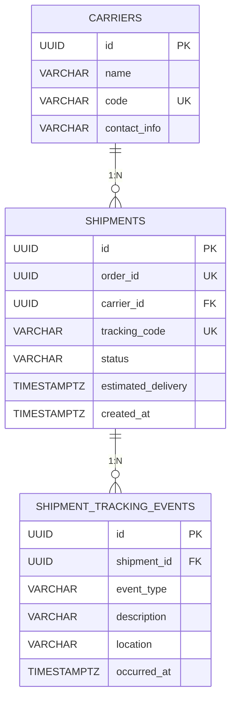
```mermaid
erDiagram
    CARRIERS ||--o{ SHIPMENTS : "1:N"
    SHIPMENTS ||--o{ SHIPMENT_TRACKING_EVENTS : "1:N"

    CARRIERS {
        UUID id PK
        VARCHAR name
        VARCHAR code UK
        VARCHAR contact_info
    }

    SHIPMENTS {
        UUID id PK
        UUID order_id UK
        UUID carrier_id FK
        VARCHAR tracking_code UK
        VARCHAR status
        TIMESTAMPTZ estimated_delivery
        TIMESTAMPTZ created_at
    }

    SHIPMENT_TRACKING_EVENTS {
        UUID id PK
        UUID shipment_id FK
        VARCHAR event_type
        VARCHAR description
        VARCHAR location
        TIMESTAMPTZ occurred_at
    }
```

> [!info]- Figura 3.12 — Diagrama ER do `shipping_db`

#### 3.7.6 Especificação de API

**`GET /api/v1/shipments/{orderId}`** — Consulta a remessa e o histórico de rastreamento associados a um pedido.

```json
// RESPONSE 200 OK
{
  "orderId": "uuid", "trackingCode": "string", "carrier": "string",
  "status": "IN_TRANSIT", "estimatedDelivery": "date-time",
  "trackingEvents": [ { "eventType": "PICKED_UP", "location": "Toronto, ON",
    "occurredAt": "date-time" } ]
}
```

_Erros:_ `404` remessa não encontrada

**`POST /api/v1/shipments/{orderId}/tracking-events`** — Endpoint interno (usado pelo adaptador da transportadora/webhook) para registrar um novo evento de rastreio.

```json
// REQUEST BODY
{ "eventType": "OUT_FOR_DELIVERY", "description": "string", "location": "string" }
```

Resposta: `201 Created` — se `eventType = DELIVERED`, atualiza `shipments.status` e publica `shipping.delivered`

#### 3.7.7 Eventos

|Direção|Canal|Nome|Quando|
|---|---|---|---|
|Consome|Kafka — `shipping.requested`|—|Dispara a criação da remessa e chamada ao adaptador da transportadora.|
|Publica|Kafka — `shipping.dispatched`|`ShipmentDispatchedEvent`|Remessa criada e código de rastreio obtido com sucesso.|
|Publica|Kafka — `shipping.failed`|`ShipmentFailedEvent`|Falha ao criar remessa (ex.: endereço inválido, transportadora indisponível).|
|Publica|Kafka — `shipping.delivered`|`ShipmentDeliveredEvent`|Evento de rastreio do tipo `DELIVERED` registrado.|
|Publica|RabbitMQ — fila `notification.email.queue`|`SendEmailCommand`|A cada mudança relevante de status, solicita notificação ao cliente.|

---

### 3.8 Notification Service

#### 3.8.1 Responsabilidades

- Consumir eventos de domínio relevantes (Kafka) e comandos diretos (RabbitMQ) para disparar notificações transacionais.
- Renderizar mensagens a partir de templates versionados por canal (e-mail, SMS, push) e localidade.
- Distribuir o trabalho de envio entre múltiplas instâncias via filas RabbitMQ (padrão _competing consumers_), com nova tentativa automática e Dead Letter Queue (DLQ) para falhas persistentes.
- Manter log de auditoria de todas as notificações enviadas/falhas.

#### 3.8.2 Stack Específica

|Item|Escolha|
|---|---|
|Framework|Quarkus (Kotlin) — Kotlin Coroutines para workers concorrentes de fila|
|Banco de dados|PostgreSQL 16 — schema `notification_db` (templates + log)|
|Mensageria|Consome Kafka (eventos de domínio de todos os serviços) e RabbitMQ (comandos diretos de Order/Shipping/Payment)|
|Integração externa|Adapter mock de provedor de e-mail/SMS, com contrato compatível com SendGrid/Twilio|
|Confiabilidade|RabbitMQ: retry (3x, backoff) + Dead Letter Exchange `notification.dlx` para mensagens não processáveis|

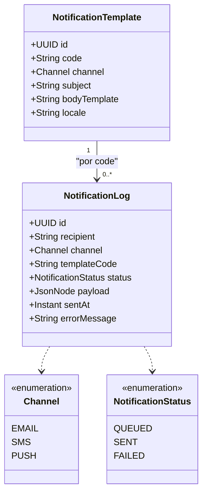
```mermaid
classDiagram
    direction TB

    class NotificationTemplate {
        +UUID id
        +String code
        +Channel channel
        +String subject
        +String bodyTemplate
        +String locale
    }

    class NotificationLog {
        +UUID id
        +String recipient
        +Channel channel
        +String templateCode
        +NotificationStatus status
        +JsonNode payload
        +Instant sentAt
        +String errorMessage
    }

    class Channel {
        <<enumeration>>
        EMAIL
        SMS
        PUSH
    }

    class NotificationStatus {
        <<enumeration>>
        QUEUED
        SENT
        FAILED
    }

    NotificationTemplate "1" --> "0..*" NotificationLog : "por code"
    NotificationLog ..> Channel
    NotificationLog ..> NotificationStatus
```

> [!info]- Figura 3.13 — Modelo de domínio do Notification Service

#### 3.8.4 Modelo de Dados (DDL — PostgreSQL)

```sql
CREATE TABLE notification_templates (
    id UUID PRIMARY KEY DEFAULT gen_random_uuid(),
    code VARCHAR(80) NOT NULL UNIQUE, -- ex: ORDER_CONFIRMED_EMAIL
    channel VARCHAR(10) NOT NULL, -- EMAIL | SMS | PUSH
    subject VARCHAR(200),
    body_template TEXT NOT NULL, -- template com placeholders {{var}}
    locale VARCHAR(10) NOT NULL DEFAULT 'en-CA'
);

CREATE TABLE notification_logs (
    id UUID PRIMARY KEY DEFAULT gen_random_uuid(),
    recipient VARCHAR(180) NOT NULL,
    channel VARCHAR(10) NOT NULL,
    template_code VARCHAR(80) NOT NULL,
    status VARCHAR(20) NOT NULL DEFAULT 'QUEUED', -- QUEUED | SENT | FAILED
    payload JSONB,
    sent_at TIMESTAMPTZ,
    error_message VARCHAR(500)
);
CREATE INDEX idx_notification_logs_recipient ON notification_logs(recipient);
```

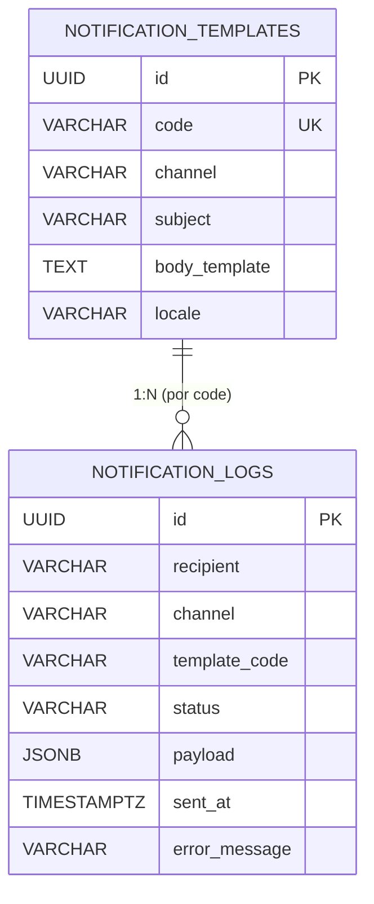
```mermaid
erDiagram
    NOTIFICATION_TEMPLATES ||--o{ NOTIFICATION_LOGS : "1:N (por code)"

    NOTIFICATION_TEMPLATES {
        UUID id PK
        VARCHAR code UK
        VARCHAR channel
        VARCHAR subject
        TEXT body_template
        VARCHAR locale
    }

    NOTIFICATION_LOGS {
        UUID id PK
        VARCHAR recipient
        VARCHAR channel
        VARCHAR template_code
        VARCHAR status
        JSONB payload
        TIMESTAMPTZ sent_at
        VARCHAR error_message
    }
```

> [!info]- Figura 3.14 — Diagrama ER do `notification_db`

#### 3.8.6 Especificação de API

**`GET /api/v1/notifications`** — Consulta o log de notificações (uso administrativo/suporte). Requer `ROLE_ADMIN`. _Query params:_ `recipient`, `status`, `page`, `size` Resposta: `200 OK` — página de `NotificationLog`

**`POST /api/v1/notifications/{id}/resend`** — Reenvia manualmente uma notificação que falhou, republicando na fila correspondente. Requer `ROLE_ADMIN`. Resposta: `202 Accepted`

#### 3.8.7 Eventos

|Direção|Canal|Ação|
|---|---|---|
|Consome|Kafka — `user.registered`|Envia e-mail de boas-vindas (`WELCOME_EMAIL`).|
|Consome|Kafka — `order.cancelled`|Envia e-mail de cancelamento de pedido.|
|Consome|Kafka — `payment.refunded`|Envia e-mail de confirmação de estorno.|
|Consome|RabbitMQ — `notification.email.queue`|Processa comandos diretos de envio de e-mail publicados por Order/Shipping.|
|Consome|RabbitMQ — `notification.sms.queue`|Processa comandos de envio de SMS (ex.: código de rastreio).|
|Publica (DLQ)|RabbitMQ — `notification.dlx`|Mensagens que falharam após 3 tentativas são roteadas para inspeção manual.|

---

## 4. Fluxos Principais (Diagramas de Sequência)

Esta seção detalha, passo a passo, os quatro fluxos de execução mais importantes do sistema, cobrindo autenticação, o caminho feliz completo da saga de pedido, o fluxo de compensação em caso de falha, e o padrão de leitura com cache.

### 4.1 Autenticação e Validação de Token

![[30-seq-login.png]]

> [!info]- Figura 4.1 — Sequência de Login e Validação de Token Fluxo de login emitindo par de tokens (access + refresh), seguido de uma requisição subsequente autenticada, ilustrando a validação local de JWT no Gateway (via JWKS) combinada com verificação de sessão ativa no Identity Service.

### 4.2 Criação de Pedido — Saga (Caminho Feliz)

![[31-seq-place-order-happy.png]]

> [!info]- Figura 4.2 — Sequência completa da Saga de Criação de Pedido (caminho feliz) Fluxo completo desde a requisição do cliente até a notificação de confirmação, passando pelas três etapas coordenadas da saga: reserva de estoque, autorização de pagamento e criação de remessa.
> 
> Observe que a resposta HTTP `201 Created` ao cliente ocorre imediatamente após a criação do pedido (estado `CREATED`), **antes** da conclusão da saga — o cliente acompanha o progresso via `GET /api/v1/orders/{id}` ou por atualização em tempo real (WebSocket/SSE, fora do escopo deste documento).

### 4.3 Saga — Fluxo de Compensação

![[32-seq-saga-compensation.png]]

> [!info]- Figura 4.3 — Sequência de Compensação da Saga (falha no pagamento) Cenário em que o gateway de pagamento recusa a transação após o estoque já ter sido reservado. O Order Service detecta a falha via evento `payment.failed`, transiciona a saga para `COMPENSATING` e dispara o comando de liberação de estoque, finalizando o pedido em `FAILED` apenas após a confirmação de que a compensação foi aplicada.

> [!important] Falha na etapa de remessa A mesma estrutura de compensação se aplica a uma falha na etapa de remessa (`shipping.failed`), com a diferença de que, nesse caso, duas compensações são disparadas em paralelo/sequência: estorno do pagamento **e** liberação do estoque (ver [[#2.5 Padrão Saga Orquestração — Visão Geral|Figura 2.3]]).

### 4.4 Consulta de Catálogo com Cache Redis

![[33-seq-catalog-cache.png]]

> [!info]- Figura 4.4 — Sequência de Leitura de Produto com Cache-Aside Padrão cache-aside aplicado à leitura de produto individual, com TTL de 300 segundos e fallback transparente ao PostgreSQL em caso de cache miss. <!-- [ATUALIZADO] a chave de cache é por moeda (`product:{sku}:{currency}`) e o SELECT do cache miss lê `variant_prices` vigentes na moeda solicitada -->

---

## 5. Catálogo de Contratos de Eventos e Mensagens

Todo evento publicado no Kafka e todo comando publicado no RabbitMQ segue um envelope padrão, garantindo rastreabilidade e auditabilidade uniformes em toda a plataforma:

```json
{
  "eventId": "uuid",                 // identificador único do evento (para deduplicação)
  "eventType": "order.created",      // nome lógico do evento (igual ao nome do tópico/routing key)
  "eventVersion": 1,                 // versão do schema, para evolução compatível
  "occurredAt": "2026-07-22T14:32:10.500Z",
  "traceId": "4bf92f3577b34da6a3ce929d0e0e4736", // correlação com OpenTelemetry
  "producer": "order-service",
  "payload": { }                     // objeto específico do evento — ver tabelas abaixo
}
```

### 5.1 Tópicos Kafka (Eventos de Domínio)

|Tópico|Partição/Chave|Produtor|Consumidores|Payload (principais campos)|
|---|---|---|---|---|
|`user.registered`|`userId`|Identity|Notification|`userId`, `fullName`, `email`|
|`catalog.price-changed`|`productVariantId`|Catalog|(extensível: motor de busca)|`productVariantId`, `oldPriceCents` (nulo no primeiro preço da moeda), `newPriceCents`, `currency`|
|`catalog.price-ended`|`productVariantId`|Catalog|(extensível: motor de busca)|`productVariantId`, `currency`, `effectiveTo` <!-- [NOVO] -->|
|`catalog.product-status-changed`|`productId`|Catalog|Order (validação em criação de pedido)|`productId`, `status`|
|`order.created`|`orderId`|Order|Inventory|`orderId`, `customerId`, `items[{productVariantId, quantity}]`|
|`inventory.reserved`|`orderId`|Inventory|Order|`orderId`, `reservations[{productVariantId, warehouseId, quantity}]`|
|`inventory.reservation-failed`|`orderId`|Inventory|Order|`orderId`, `unavailableItems[{productVariantId, requested, available}]`|
|`inventory.release`|`orderId`|Order|Inventory|`orderId`, `reason`|
|`inventory.released`|`orderId`|Inventory|Order|`orderId`|
|`payment.requested`|`orderId`|Order|Payment|`orderId`, `customerId`, `amountCents`, `currency`, `method`|
|`payment.authorized`|`orderId`|Payment|Order|`orderId`, `paymentId`, `gatewayReference`|
|`payment.failed`|`orderId`|Payment|Order|`orderId`, `reason`, `gatewayErrorCode`|
|`payment.refunded`|`orderId`|Payment|Notification|`orderId`, `amountCents`, `refundId`|
|`shipping.requested`|`orderId`|Order|Shipping|`orderId`, `shippingAddress`|
|`shipping.dispatched`|`orderId`|Shipping|Order, Notification|`orderId`, `shipmentId`, `trackingCode`, `carrier`|
|`shipping.failed`|`orderId`|Shipping|Order|`orderId`, `reason`|
|`shipping.delivered`|`orderId`|Shipping|Order, Notification|`orderId`, `shipmentId`, `deliveredAt`|
|`order.cancelled`|`orderId`|Order|Notification|`orderId`, `reason`|

> [!note] Configuração de tópicos (padrão) 6 partições, fator de replicação 3 (produção), retenção de 7 dias, chave de partição sempre igual a `orderId` (ou `userId`/`productVariantId` quando não há pedido envolvido) para garantir ordenação de eventos relativos à mesma entidade.

### 5.2 Filas RabbitMQ (Comandos de Trabalho)

|Exchange / Fila|Tipo|Produtores|Consumidor|Payload (principais campos)|
|---|---|---|---|---|
|`notification.exchange` → `notification.email.queue`|Direct|Order, Shipping, Payment, Notification (self, boas-vindas)|Notification (worker pool)|`recipient`, `templateCode`, `variables{}`|
|`notification.exchange` → `notification.sms.queue`|Direct|Shipping|Notification (worker pool)|`recipient`, `templateCode`, `variables{}`|
|`notification.exchange` → `notification.push.queue`|Direct|Order|Notification (worker pool)|`deviceToken`, `templateCode`, `variables{}`|
|`notification.dlx` → `notification.dlq`|Dead Letter|RabbitMQ broker (automático)|Processo de inspeção manual / alerta|Mensagem original + `x-death` headers|

> [!note] Política de retry Cada fila principal possui `x-message-ttl` de 5s e `x-dead-letter-exchange` apontando para uma fila de retry; após 3 tentativas sem sucesso (rastreadas pelo header `x-retry-count`), a mensagem é roteada definitivamente para `notification.dlx`.

### 5.3 Convenções de Nomenclatura e Idempotência

- **Nomenclatura de tópicos/eventos:** `{dominio}.{fato_passado}`, sempre no passado (ex.: `order.created`, nunca `order.create`), pois eventos representam fatos imutáveis já ocorridos.
- **Comandos (RabbitMQ):** nomeados no imperativo (ex.: `SendEmailCommand`), pois representam uma solicitação de ação, não um fato consumado.
- **Idempotência do consumidor:** todo consumidor Kafka mantém uma tabela/registro de `eventId` processados (ou usa a chave de negócio, ex.: `order_id` com constraint `UNIQUE`) e ignora silenciosamente eventos duplicados — essencial já que Kafka garante entrega _at-least-once_.
- **Compatibilidade de schema:** novos campos devem ser opcionais (aditivos); mudanças incompatíveis exigem novo tópico versionado (ex.: `order.created.v2`) com período de transição em paralelo.

---

## 6. Segurança

### 6.1 Autenticação e Autorização

**Modelo:** OAuth2/JWT com tokens assinados (RS256). O Identity Service é o único emissor; os demais serviços atuam como Resource Servers, validando a assinatura via chave pública exposta em `/.well-known/jwks.json`.

**Access Token:** vida útil de 15 minutos. Claims: `sub` (email), `uid` (UUID do usuário), `jti` (identificador único deste token, usado na revogação individual), `iat` (instante de emissão, usado na revogação global) e `roles`.

> [!note] O conteúdo do payload não é confidencial (JWT é apenas assinado, não criptografado) — nenhum dado sensível (senha, dado de pagamento) é incluído; a integridade é garantida pela assinatura RS256, que invalida o token inteiro caso qualquer claim seja adulterado.

**Refresh Token:** opaco (não-JWT), vida útil de 30 dias, persistido no PostgreSQL (tabela `refresh_tokens`) como fonte da verdade — nunca em texto puro, apenas hash SHA-256 —, com rotação a cada uso (refresh token de uso único) e campo `revoked` preservado para auditoria (nunca `DELETE` físico).

**Revogação de Access Token — deny-list em dois níveis, ambos no Redis:**

- **Individual** (logout de um dispositivo): chave `blacklist:{jti}`, TTL igual ao tempo restante de vida do token. Consultada a cada requisição autenticada, após validação de assinatura/expiração.
- **Global** (todos os dispositivos simultaneamente — bloqueio administrativo de conta, exclusão de conta): chave `revoke-all:{userId}`, armazenando o instante da revogação. Qualquer token com `iat` anterior a esse carimbo é considerado inválido, independentemente de seu `jti` — não é necessário enumerar sessões ativas.
- **Compensação por ownership:** um usuário sempre pode revogar a própria conta (self); apenas `ROLE_ADMIN` pode revogar a conta de terceiros (ver [[#3.2.6 Especificação de API|3.2.6]], endpoint `DELETE /api/v1/users/{id}`).

**Autorização:** RBAC (Role-Based Access Control) com papéis `ROLE_CUSTOMER`, `ROLE_SELLER`, `ROLE_ADMIN`, organizados em hierarquia (`ROLE_ADMIN` alcança `ROLE_SELLER` e `ROLE_CUSTOMER`), aplicado via `@PreAuthorize` (Spring Security) ou interceptors equivalentes no Quarkus. Regras de autorização por recurso ("dono ou administrador") são centralizadas em um serviço de autorização dedicado, referenciado via SpEL nas anotações `@PreAuthorize`.

**Serviço-a-serviço:** dentro do cluster, tráfego leste-oeste protegido por mTLS (AWS/EKS com service mesh — ex.: Istio/Linkerd ou AWS App Mesh, opcional) e/ou validação do token propagado pelo Gateway.

> [!warning] Pendência de implementação O par de chaves RSA usado para assinar os Access Tokens deve ser fixo e persistido (arquivo `.pem`, variável de ambiente ou AWS Secrets Manager em produção) — gerar um par novo e aleatório a cada inicialização do serviço invalida todos os tokens emitidos anteriormente a cada reinício/deploy e impede múltiplas réplicas de validarem tokens umas das outras.

### 6.2 Proteção de Dados

- Senhas nunca armazenadas em texto puro — hash BCrypt (custo 12) apenas.
- Dados de cartão de crédito nunca tocam os serviços do OrbitCommerce — tokenização ocorre inteiramente no gateway de pagamento externo (compatível com PCI-DSS SAQ-A).
- TLS 1.2+ obrigatório em todas as comunicações externas (cliente → Gateway) e internas (Gateway → serviços, serviço → serviço).
- Segredos (credenciais de banco, chaves JWT, API keys) geridos via **AWS Secrets Manager**, nunca versionados em repositório (uso de `.env.example` apenas como referência local).

### 6.3 Superfície de Ataque e Mitigações

|Ameaça|Mitigação|
|---|---|
|Força bruta em login|Rate limiting no Gateway + bloqueio temporário de conta após 5 tentativas falhas em 15 min|
|Replay de requisição|Header `Idempotency-Key` obrigatório em operações de escrita críticas (criação de pedido)|
|Injeção SQL|Uso exclusivo de JPA/Hibernate com queries parametrizadas; nenhuma concatenação de SQL dinâmico|
|Escalonamento de privilégio horizontal|Toda consulta de recurso (ex.: pedido) valida que `customerId` do recurso corresponde ao `sub` do token, salvo para `ROLE_ADMIN`|
|Exposição de topologia interna|Serviços de domínio não são expostos publicamente — apenas o API Gateway possui IP/DNS público|
|Uso de access token após logout, bloqueio ou exclusão de conta|Deny-list em dois níveis no Redis (`blacklist:{jti}` individual, `revoke-all:{userId}` global) consultada em toda requisição autenticada, antes de qualquer lógica de negócio (ver [[#6.1 Autenticação e Autorização|

---

## 7. Observabilidade

### 7.1 Métricas (Prometheus + Grafana)

Todos os serviços expõem métricas no formato Prometheus através de um endpoint `/metrics` (Spring: Micrometer + Actuator; Quarkus: Micrometer extension), coletadas por scraping periódico (15s).

|Categoria|Métricas-chave|
|---|---|
|RED (Request/Error/Duration)|`http_server_requests_seconds` (contagem, soma, percentis por rota/status)|
|Saga|`saga_steps_total{step,status}`, `saga_duration_seconds`|
|Mensageria|`kafka_consumer_lag`, `rabbitmq_queue_depth`, `messages_processed_total{outcome}`|
|Cache|`cache_hit_ratio{cache="product"}`|
|JVM/Runtime|heap, GC pauses, threads ativas (via Micrometer JVM binders)|

> [!tip] Dashboards Grafana propostos Visão Geral da Plataforma (RED agregado por serviço), Saúde da Saga (funil de conversão `CREATED→DELIVERED` e taxa de compensação), Mensageria (profundidade de fila/lag de consumidor) e Infraestrutura (CPU/memória de pods no EKS).

### 7.2 Tracing Distribuído (OpenTelemetry + Jaeger)

Cada serviço é instrumentado com o SDK do OpenTelemetry (auto-instrumentação para Spring Boot via Java agent; extensão nativa no Quarkus). O contexto de trace (`traceparent`, W3C Trace Context) é propagado:

- Em requisições HTTP síncronas, via headers padrão;
- Em mensagens Kafka/RabbitMQ, via headers da mensagem (`traceId` também replicado no envelope do evento — ver [[#5 Catálogo de Contratos de Eventos e Mensagens|seção 5]] — para depuração manual em ferramentas que não leem headers binários).

Todos os spans são exportados para um OpenTelemetry Collector central, que os encaminha ao Jaeger para visualização. Isso permite visualizar, em uma única árvore de spans no Jaeger, o trajeto completo de um pedido desde o clique do cliente até a confirmação de entrega — atravessando HTTP, Kafka e múltiplos serviços.

### 7.3 Logging

Logs estruturados em JSON (campos padrão: `timestamp`, `level`, `service`, `traceId`, `spanId`, `message`), permitindo correlação direta com o trace no Jaeger. Agregação centralizada sugerida via **Amazon CloudWatch Logs** (ou stack Loki+Promtail como alternativa open-source), fora do escopo de implementação inicial mas contemplada na arquitetura.

### 7.4 Health Checks

|Endpoint|Uso|
|---|---|
|`/actuator/health/liveness` (Spring) / `/q/health/live` (Quarkus)|Liveness probe do Kubernetes — reinicia o pod se falhar|
|`/actuator/health/readiness` (Spring) / `/q/health/ready` (Quarkus)|Readiness probe — remove o pod do balanceamento até que dependências (DB, Kafka) estejam prontas|

---

## 8. Estratégia de Testes

A estratégia segue a pirâmide de testes, com ênfase adicional em testes de integração dado o caráter distribuído do sistema — a maior fonte de risco em uma arquitetura de microsserviços não está na lógica unitária, e sim nos pontos de integração (banco, mensageria, contratos entre serviços).

|Camada|Ferramentas|O que é testado|Meta de cobertura|
|---|---|---|---|
|Unitária|JUnit 5 + Mockito|Regras de negócio isoladas (ex.: cálculo de subtotal, transições válidas de estado do pedido, validação de payload), com dependências externas (repositórios, clients HTTP, producers) mockadas.|≥ 80% em classes de domínio/serviço|
|Integração|JUnit 5 + Testcontainers (PostgreSQL, Kafka, RabbitMQ, Redis)|Repositórios JPA contra PostgreSQL real; publicação/consumo de eventos contra Kafka/RabbitMQ reais em contêiner efêmero; cache-aside contra Redis real.|Todos os fluxos críticos de persistência e mensageria cobertos|
|Contrato (API)|Spring Cloud Contract / Pact (sugerido para evolução)|Garantia de que o contrato de API/evento publicado por um serviço não quebra o consumidor.|Contratos críticos entre Order↔Inventory↔Payment↔Shipping|
|Ponta a ponta (E2E)|REST Assured / Karate (sugerido) rodando contra ambiente Docker Compose completo|Fluxo completo de criação de pedido do início ao fim, incluindo compensação.|Cenários de caminho feliz + 2 cenários de falha (estoque insuficiente, pagamento recusado)|

### 8.1 Exemplo — Teste de Integração com Testcontainers (Order Service)

```java
import org.junit.jupiter.api.Test;
import org.springframework.beans.factory.annotation.Autowired;
import org.springframework.boot.test.context.SpringBootTest;
import org.springframework.http.MediaType;
import org.springframework.test.context.DynamicPropertyRegistry;
import org.springframework.test.context.DynamicPropertySource;
import org.springframework.test.web.servlet.MockMvc;
import org.testcontainers.containers.KafkaContainer;
import org.testcontainers.containers.PostgreSQLContainer;
import org.testcontainers.junit.jupiter.Container;
import org.testcontainers.junit.jupiter.Testcontainers;
import org.testcontainers.utility.DockerImageName;
import org.apache.kafka.clients.consumer.ConsumerRecord;
import org.springframework.kafka.test.utils.KafkaTestUtils;

import java.time.Duration;
import java.util.UUID;

import static org.assertj.core.api.Assertions.assertThat;
import static org.springframework.test.web.servlet.request.MockMvcRequestBuilders.post;
import static org.springframework.test.web.servlet.result.MockMvcResultMatchers.jsonPath;
import static org.springframework.test.web.servlet.result.MockMvcResultMatchers.status;

@SpringBootTest
@Testcontainers
class OrderCreationIntegrationTest {

    @Container
    static PostgreSQLContainer<?> postgres =
            new PostgreSQLContainer<>("postgres:16-alpine")
                    .withDatabaseName("order_db");

    @Container
    static KafkaContainer kafka =
            new KafkaContainer(DockerImageName.parse("confluentinc/cp-kafka:7.6.0"));

    @DynamicPropertySource
    static void properties(DynamicPropertyRegistry registry) {
        registry.add("spring.datasource.url", postgres::getJdbcUrl);
        registry.add("spring.kafka.bootstrap-servers", kafka::getBootstrapServers);
    }

    @Autowired MockMvc mockMvc;
    @Autowired OrderRepository orderRepository;

    @Test
    void deveCriarPedidoEPublicarOrderCreated() throws Exception {
        mockMvc.perform(post("/api/v1/orders")
                        .header("Idempotency-Key", UUID.randomUUID().toString())
                        .contentType(MediaType.APPLICATION_JSON)
                        .content(sampleOrderPayload()))
                .andExpect(status().isCreated())
                .andExpect(jsonPath("$.status").value("CREATED"));

        // valida persistencia
        assertThat(orderRepository.count()).isEqualTo(1);

        // valida publicacao no Kafka (consumer de teste)
        ConsumerRecord<String, String> record = KafkaTestUtils.getSingleRecord(
                testConsumer, "order.created", Duration.ofSeconds(5));
        assertThat(record.value()).contains("\"eventType\":\"order.created\"");
    }
}
```

### 8.2 Exemplo — Teste Unitário com Mockito (regra de negócio)

```java
import org.junit.jupiter.api.Test;
import org.junit.jupiter.api.extension.ExtendWith;
import org.mockito.InjectMocks;
import org.mockito.Mock;
import org.mockito.junit.jupiter.MockitoExtension;

import java.util.Optional;

import static org.assertj.core.api.Assertions.assertThatThrownBy;
import static org.mockito.ArgumentMatchers.any;
import static org.mockito.BDDMockito.given;

@ExtendWith(MockitoExtension.class)
class OrderStateMachineTest {

    @Mock OrderRepository orderRepository;
    @InjectMocks OrderService orderService;

    @Test
    void naoDevePermitirTransicaoDeCancelledParaShipped() {
        Order order = Order.builder().status(OrderStatus.CANCELLED).build();
        given(orderRepository.findById(any())).willReturn(Optional.of(order));

        assertThatThrownBy(() -> orderService.markAsShipped(order.getId()))
                .isInstanceOf(InvalidOrderTransitionException.class)
                .hasMessageContaining("CANCELLED");
    }
}
```

### 8.3 Testes em Kotlin/Quarkus (Inventory Service)

```kotlin
import io.quarkus.test.junit.QuarkusTest
import jakarta.inject.Inject
import kotlinx.coroutines.test.runTest
import org.junit.jupiter.api.Assertions.assertEquals
import org.junit.jupiter.api.Test
import java.util.UUID

@QuarkusTest
class StockReservationTest {

    @Inject
    lateinit var reservationService: StockReservationService

    @Test
    fun `deve reservar estoque quando quantidade disponivel e suficiente`() = runTest {
        val result = reservationService.reserve(
            orderId = UUID.randomUUID(),
            items = listOf(ReservationRequest(variantId, quantity = 2))
        )
        assertEquals(ReservationStatus.RESERVED, result.status)
    }
}
```

> [!note] Política de CI O pipeline do GitHub Actions falha o build se a cobertura de linhas cair abaixo do limiar configurado (JaCoCo) ou se qualquer teste de integração com Testcontainers falhar — nenhum merge é permitido na branch principal sem os testes verdes (ver [[#9 Infraestrutura Contêineres e CICD|seção 9]]).

---

## 9. Infraestrutura, Contêineres e CI/CD

### 9.1 Ambiente Local de Desenvolvimento (Docker Compose)

O repositório disponibiliza um `docker-compose.yml` que sobe toda a plataforma localmente: 8 serviços de aplicação, 7 instâncias PostgreSQL (ou um único PostgreSQL com múltiplos schemas, para economizar recursos em máquinas de desenvolvimento), Redis, Kafka + Zookeeper (ou modo KRaft), RabbitMQ com plugin de management, Prometheus, Grafana, Jaeger e o OpenTelemetry Collector.

```yaml
# Estrutura resumida do docker-compose.yml
services:
  postgres: { image: postgres:16-alpine }
  redis: { image: redis:7-alpine }
  kafka: { image: confluentinc/cp-kafka:7.6.0 }
  rabbitmq: { image: rabbitmq:3.13-management-alpine }
  otel-collector: { image: otel/opentelemetry-collector-contrib:latest }
  jaeger: { image: jaegertracing/all-in-one:latest }
  prometheus: { image: prom/prometheus:latest }
  grafana: { image: grafana/grafana:latest }
  identity-service: { build: ./services/identity-service }
  catalog-service: { build: ./services/catalog-service }
  order-service: { build: ./services/order-service }
  inventory-service: { build: ./services/inventory-service }
  payment-service: { build: ./services/payment-service }
  shipping-service: { build: ./services/shipping-service }
  notification-service: { build: ./services/notification-service }
  api-gateway: { build: ./services/api-gateway, ports: ["8080:8080"] }
```

### 9.2 Empacotamento em Contêiner

|Serviços Java (Spring Boot)|Serviços Kotlin (Quarkus)|
|---|---|
|Build multi-stage com `eclipse-temurin:25-jdk` <!-- [ATUALIZADO] era :21-jdk --> (build) → `eclipse-temurin:25-jre-alpine` <!-- [ATUALIZADO] era :21-jre-alpine --> (runtime); camadas otimizadas via `spring-boot:build-image` (Cloud Native Buildpacks) ou Dockerfile com layertools.|Build multi-stage com imagem nativa GraalVM via **Mandrel 25** <!-- [NOVO] builder image baseado em OpenJDK 25 --> (`quarkus.native.builder-image=quay.io/quarkus/ubi-quarkus-mandrel-builder-image:25.0-java25`, `quarkus.native.container-build=true`), gerando executável nativo com startup em milissegundos e footprint de memória reduzido — ideal para autoscaling agressivo.|

### 9.3 Arquitetura de Deploy na AWS

|Componente AWS|Papel|
|---|---|
|**Amazon EKS** (Elastic Kubernetes Service)|Orquestração dos 8 serviços + Gateway, com Horizontal Pod Autoscaler por serviço|
|**Amazon ECR** (Elastic Container Registry)|Registro privado de imagens Docker, integrado ao pipeline de CI/CD|
|**Amazon RDS for PostgreSQL**|Uma instância gerenciada por serviço (ou schemas isolados em instâncias compartilhadas por ambiente não produtivo); Multi-AZ para alta disponibilidade em produção|
|**Amazon ElastiCache for Redis**|Cluster gerenciado compartilhado entre Identity, Catalog e Order|
|**Amazon MSK** (Managed Streaming for Apache Kafka) ou Kafka self-hosted|Backbone de eventos gerenciado como alternativa a operar Kafka manualmente no EKS (Strimzi Operator)|
|**Amazon MQ** (RabbitMQ gerenciado) ou RabbitMQ self-hosted no EKS|Alternativa gerenciada às filas de trabalho de notificação|
|**AWS Secrets Manager**|Armazenamento de segredos (connection strings, chaves JWT), injetados via Secrets Store CSI Driver (AWS provider)|
|**Application Load Balancer (ALB)** / Amazon CloudFront + AWS WAF|TLS termination, WAF e distribuição geográfica na borda, à frente do API Gateway|
|**Amazon CloudWatch** / Amazon Managed Grafana / Amazon Managed Service for Prometheus (AMP)|Alternativa gerenciada à stack de observabilidade self-hosted|

> [!tip] Alternativa Azure Para o mapeamento completo destes componentes para a Microsoft Azure, ver [[#13 Portabilidade de Nuvem Adaptando o Projeto para Microsoft Azure|seção 13]].

### 9.4 Pipeline de CI/CD (GitHub Actions)

O monorepo utiliza um workflow por serviço, disparado apenas quando arquivos sob o respectivo path são alterados (`paths:` filter), evitando rebuilds desnecessários:

```yaml
# .github/workflows/order-service.yml (exemplo)
name: order-service-ci-cd

on:
  push:
    branches: [main]
    paths: ["services/order-service/**"]
  pull_request:
    paths: ["services/order-service/**"]

jobs:
  build-test:
    runs-on: ubuntu-latest
    steps:
      - uses: actions/checkout@v4
      - uses: actions/setup-java@v4
        with: { java-version: '25', distribution: 'temurin' } # [ATUALIZADO] era '21'
      - name: Testes unitarios e de integracao (Testcontainers)
        run: ./gradlew :order-service:test :order-service:integrationTest
      - name: Relatorio de cobertura (JaCoCo)
        run: ./gradlew :order-service:jacocoTestReport
      - name: Analise estatica (SonarCloud/Checkstyle)
        run: ./gradlew :order-service:sonar

  # job de build/push usando Amazon ECR, com autenticação via OIDC
  # (sem access keys estáticas no repositório)
  build-push-image:
    needs: build-test
    if: github.ref == 'refs/heads/main'
    runs-on: ubuntu-latest
    permissions:
      id-token: write # necessário para OIDC
      contents: read
    steps:
      - uses: actions/checkout@v4
      - name: Configurar credenciais AWS (OIDC)
        uses: aws-actions/configure-aws-credentials@v4
        with:
          role-to-assume: arn:aws:iam::<account-id>:role/github-actions-orbitcommerce
          aws-region: ca-central-1
      - name: Login no Amazon ECR
        id: ecr-login
        uses: aws-actions/amazon-ecr-login@v2
      - name: Build e push da imagem
        run: |
          docker build -t ${{ steps.ecr-login.outputs.registry }}/order-service:${{ github.sha }} \
            ./services/order-service
          docker push ${{ steps.ecr-login.outputs.registry }}/order-service:${{ github.sha }}

  deploy-eks:
    needs: build-push-image
    runs-on: ubuntu-latest
    steps:
      - uses: aws-actions/configure-aws-credentials@v4
        with:
          role-to-assume: arn:aws:iam::<account-id>:role/github-actions-orbitcommerce
          aws-region: ca-central-1
      - name: Atualizar kubeconfig do cluster EKS
        run: aws eks update-kubeconfig --name orbitcommerce-cluster --region ca-central-1
      - name: Deploy via Helm
        run: |
          helm upgrade --install order-service ./charts/order-service \
            --set image.tag=${{ github.sha }} --namespace orbitcommerce
```

> [!tip] Estratégia de release Deploy incremental por serviço (não há "big-bang deploy" da plataforma inteira), com rolling update no EKS e checagem automática de readiness probe antes de rotear tráfego para os novos pods. Compatibilidade de contrato de evento entre versões é garantida pelas convenções da [[#5.3 Convenções de Nomenclatura e Idempotência|seção 5.3]].

---

## 10. Organização de Repositórios e Estrutura de Pastas

Recomenda-se um **monorepo** para facilitar navegação, revisão de PRs que atravessam múltiplos serviços (ex.: alteração de contrato de evento) e reuso de bibliotecas comuns, mantendo pipelines de CI/CD independentes por serviço via path filters ([[#9.4 Pipeline de CICD GitHub Actions|seção 9.4]]).

```text
orbitcommerce/
├── services/
│   ├── api-gateway/            (Java · Spring Cloud Gateway)
│   ├── identity-service/       (Java · Spring Boot)
│   ├── catalog-service/        (Java · Spring Boot)
│   ├── order-service/          (Java · Spring Boot)
│   ├── inventory-service/      (Kotlin · Quarkus)
│   ├── payment-service/        (Java · Spring Boot)
│   ├── shipping-service/       (Kotlin · Quarkus)
│   └── notification-service/   (Kotlin · Quarkus)
│
├── libs/                          # bibliotecas compartilhadas (publicadas internamente)
│   ├── event-contracts/           # DTOs/JSON Schemas dos eventos (seção 5)
│   ├── observability-starter/     # config comum de OpenTelemetry/Micrometer
│   └── security-commons/          # validação de JWT, filtros comuns
│
├── charts/                        # Helm charts (um por serviço) para deploy no EKS
│   ├── order-service/
│   └── ...
│
├── docker-compose.yml                  # ambiente local completo
├── docker-compose.observability.yml    # stack de observabilidade isolada (opcional)
│
├── .github/workflows/              # um workflow por serviço + workflows compartilhados
│   ├── order-service.yml
│   ├── ...
│   └── shared-lint.yml
│
└── docs/
    ├── architecture/    # este documento e ADRs (Architecture Decision Records)
    └── diagrams/        # fontes dos diagramas (Graphviz/scripts)
```

### 10.1 Estrutura Interna de um Serviço Java/Spring Boot (exemplo: order-service)

```text
order-service/
├── src/main/java/com/orbitcommerce/order/
│   ├── domain/            # entidades JPA, value objects, enums (Order, OrderItem, SagaInstance...)
│   ├── application/       # casos de uso / services (OrderService, SagaOrchestrator)
│   ├── infrastructure/
│   │   ├── persistence/   # repositórios Spring Data JPA
│   │   ├── messaging/     # producers/consumers Kafka, mapeamento de eventos
│   │   └── client/        # clientes REST para outros serviços (fallback síncrono)
│   └── api/                # controllers REST, DTOs de request/response, exception handlers
├── src/main/resources/
│   ├── application.yml
│   └── db/migration/       # scripts Flyway (V1__init.sql, V2__add_saga_tables.sql, ...)
├── src/test/java/...              # testes unitários
├── src/integrationTest/java/...   # testes com Testcontainers
├── build.gradle.kts
└── Dockerfile
```

### 10.2 Estrutura Interna de um Serviço Kotlin/Quarkus (exemplo: inventory-service)

```text
inventory-service/
├── src/main/kotlin/com/orbitcommerce/inventory/
│   ├── domain/            # StockItem, StockReservation, enums
│   ├── application/       # StockReservationService (suspend functions)
│   ├── infrastructure/
│   │   ├── persistence/   # repositórios Panache
│   │   └── messaging/     # @Incoming/@Outgoing (SmallRye Reactive Messaging)
│   └── api/                # resources REST (JAX-RS)
├── src/main/resources/
│   ├── application.properties
│   └── db/migration/
├── src/test/kotlin/...     # @QuarkusTest
├── build.gradle.kts
└── src/main/docker/Dockerfile.native
```

> [!note] Cada serviço mantém migrações de banco de dados versionadas com **Flyway**, garantindo que o schema exato descrito na [[#3 Especificação dos Serviços|seção 3]] (DDL de cada serviço) seja reproduzível em qualquer ambiente a partir de um banco vazio.

---

## 11. Roadmap de Implementação Sugerido (Portfólio)

Para quem for implementar este projeto como peça de portfólio, recomenda-se uma ordem incremental que entrega valor demonstrável a cada etapa, em vez de tentar construir os oito serviços simultaneamente.

|Fase|Entregável|O que fica demonstrado|
|---|---|---|
|1|Identity Service completo (cadastro, login, JWT, Redis) + Catalog Service (CRUD + cache-aside) + API Gateway básico|Domínio de Spring Boot, Spring Security/JWT, JPA, Redis, testes com Testcontainers, Docker Compose|
|2|Order Service com criação de pedido simples (sem saga ainda, apenas persistência) + Inventory Service básico (CRUD de estoque) em Quarkus/Kotlin|Domínio poliglota (Java + Kotlin/Coroutines), modelagem de agregados DDD|
|3|Integração via Kafka: `order.created` → reserva de estoque → eventos de resposta, sem ainda pagamento/remessa|Event-driven architecture, Outbox Pattern, idempotência de consumidor|
|4|Payment Service + Shipping Service + Saga Orchestrator completo no Order Service, incluindo compensação|Padrão Saga orquestrada de ponta a ponta — o diferencial mais forte do projeto para entrevistas técnicas|
|5|Notification Service com RabbitMQ (worker pool + DLQ)|Contraste deliberado entre pub/sub (Kafka) e work queue (RabbitMQ) no mesmo sistema|
|6|Observabilidade completa: Prometheus + Grafana + OpenTelemetry + Jaeger instrumentando todos os serviços|Maturidade operacional — frequentemente o diferencial que separa candidatos pleno/sênior|
|7|CI/CD no GitHub Actions + deploy em EKS (ou um cluster Kubernetes gerenciado equivalente/gratuito para fins de demonstração, ex.: um único node no AWS free tier)|Prática de DevOps ponta a ponta|

> [!tip] Dica para o portfólio Grave um vídeo curto (3-5 min) demonstrando o fluxo de criação de pedido no Jaeger (mostrando o trace atravessando os serviços) e um cenário de falha com compensação visível no Grafana. Isso comunica competência em sistemas distribuídos de forma muito mais convincente do que apenas o código-fonte, especialmente para recrutadores técnicos e hiring managers no mercado canadense, que costumam valorizar evidência de raciocínio sobre trade-offs arquiteturais.

---

## 12. Glossário e Referências

|Termo|Definição|
|---|---|
|**Bounded Context**|Fronteira explícita dentro da qual um modelo de domínio é consistente e possui significado único (conceito de Domain-Driven Design). Cada serviço do OrbitCommerce corresponde a um bounded context.|
|**Saga**|Padrão para gerenciar transações distribuídas de longa duração através de uma sequência de transações locais, com ações de compensação para desfazer o trabalho em caso de falha.|
|**Outbox Pattern**|Técnica que grava o evento a ser publicado na mesma transação de banco de dados da mudança de estado, evitando inconsistência entre o estado persistido e o evento publicado.|
|**Idempotência**|Propriedade de uma operação que produz o mesmo resultado, sem efeitos colaterais adicionais, independentemente de quantas vezes é executada com a mesma entrada.|
|**Cache-Aside**|Padrão de cache onde a aplicação consulta o cache antes do banco, e popula o cache manualmente após um cache miss.|
|**Circuit Breaker**|Padrão de resiliência que interrompe temporariamente chamadas a um serviço com falha recorrente, evitando cascata de falhas e permitindo recuperação.|
|**Competing Consumers**|Padrão de mensageria onde múltiplas instâncias de um consumidor competem para processar mensagens de uma mesma fila, distribuindo a carga.|
|**Dead Letter Queue (DLQ)**|Fila para onde mensagens que falharam repetidamente no processamento são roteadas, para inspeção manual sem bloquear a fila principal.|
|**RBAC**|Role-Based Access Control — modelo de autorização baseado em papéis atribuídos a usuários.|
|**Trace Context (W3C)**|Padrão de propagação de contexto de rastreamento distribuído (`traceparent` header), usado por OpenTelemetry.|

### 12.1 Referências Técnicas

- Richardson, C. — _Microservices Patterns_ (Manning, 2018) — referência primária para os padrões Saga, Database per Service e Outbox utilizados neste documento.
- Newman, S. — _Building Microservices_, 2ª edição (O'Reilly, 2021).
- Documentação oficial: Spring Boot (spring.io), Quarkus (quarkus.io), Apache Kafka (kafka.apache.org), RabbitMQ (rabbitmq.com), OpenTelemetry (opentelemetry.io).
- AWS Architecture Center / AWS Well-Architected Framework — padrões de referência para microsserviços em EKS.

---

## 13. Portabilidade de Nuvem: Adaptando o Projeto para Microsoft Azure

> [!info] Por que esta seção existe As seções 1 a 12 especificam o OrbitCommerce assumindo a **AWS** como provedor de nuvem-alvo (Amazon EKS, RDS, ElastiCache, ECR, MSK, Secrets Manager etc. — ver [[#1.3 Stack Tecnológica e Justificativas|1.3]] e [[#9.3 Arquitetura de Deploy na AWS|9.3]]). A arquitetura, porém, foi desenhada para ser **portável**: nenhum dos oito serviços de domínio depende de um SDK proprietário de nuvem no código de negócio — a integração com a infraestrutura gerenciada ocorre exclusivamente nas bordas (connection strings, variáveis de ambiente, manifests Kubernetes e pipelines de CI/CD). Migrar de volta para a Microsoft Azure é, portanto, uma **troca de infraestrutura**, não uma reescrita de domínio.

### 13.1 Tabela de Equivalência AWS → Azure

|Camada|Componente AWS (usado nas seções 1–12)|Equivalente Azure|Observação de Migração|
|---|---|---|---|
|Orquestração de contêineres|Amazon EKS|**Azure Kubernetes Service (AKS)**|Manifests Kubernetes/Helm charts ([[#9.4 Pipeline de CICD GitHub Actions\|9.4]]) permanecem praticamente idênticos — a API do Kubernetes é a mesma; muda apenas o provisionamento do cluster (`eksctl`/Terraform `aws_eks_cluster` vira `azurerm_kubernetes_cluster`).|
|Registro de imagens|Amazon ECR|**Azure Container Registry (ACR)**|Troca de `docker push` para o endpoint do ACR (`*.azurecr.io`); no GitHub Actions, troca de `aws-actions/amazon-ecr-login` pela action `azure/docker-login`.|
|Banco relacional gerenciado|Amazon RDS for PostgreSQL|**Azure Database for PostgreSQL — Flexible Server**|Nenhuma mudança de schema/DDL ([[#3 Especificação dos Serviços\|seção 3]]) — ambos são PostgreSQL 16 padrão. Muda apenas a connection string e o mecanismo de rotação de credenciais.|
|Cache distribuído|Amazon ElastiCache for Redis|**Azure Cache for Redis**|Protocolo Redis idêntico; nenhuma mudança no código de cache-aside ([[#3.3 Catalog Service\|3.3]], [[#4.4 Consulta de Catálogo com Cache Redis\|4.4]]) ou nas chaves de idempotência/deny-list ([[#3.4.2 Stack Específica\|3.4.2]], [[#6.1 Autenticação e Autorização\|6.1]]).|
|Streaming de eventos gerenciado|Amazon MSK|**Azure Event Hubs** (endpoint compatível com Kafka)|Contratos de tópicos/eventos da [[#5 Catálogo de Contratos de Eventos e Mensagens\|seção 5]] não mudam; Event Hubs exige ajuste de configuração do cliente Kafka (SASL/OAuth em vez de IAM), mas a API do produtor/consumidor Kafka permanece a mesma.|
|Fila de trabalho (RabbitMQ)|Amazon MQ|**Azure Service Bus** ou RabbitMQ self-hosted no AKS|Se optar por Azure Service Bus em vez de RabbitMQ gerenciado, os padrões de competing consumers e DLQ ([[#5.2 Filas RabbitMQ Comandos de Trabalho\|5.2]]) mapeiam para filas e "dead-letter queue" nativa do Service Bus, mas exigem trocar o cliente RabbitMQ (AMQP 0-9-1) pelo SDK do Service Bus (AMQP 1.0).|
|Gerenciamento de segredos|AWS Secrets Manager|**Azure Key Vault**|Ambos suportam injeção via CSI Driver no Kubernetes (AWS Secrets and Configuration Provider ↔ Azure Key Vault Provider for Secrets Store CSI Driver) — a mudança fica isolada no manifest `SecretProviderClass`.|
|Borda / TLS / WAF|ALB + CloudFront + AWS WAF|**Azure Application Gateway + Azure Front Door**|Ambos oferecem TLS termination, WAF e distribuição geográfica; a configuração de rotas do API Gateway ([[#3.1.3 Tabela de Roteamento\|3.1.3]]) não é afetada.|
|Descoberta de serviço interna|AWS Cloud Map / DNS interno do EKS|DNS interno do AKS / **Azure Container Apps**|Transparente para os serviços, que já se comunicam por nome DNS estável ([[#3.1.2 Stack Específica\|3.1.2]]) em vez de IP fixo.|
|Observabilidade gerenciada|CloudWatch, Managed Grafana, AMP|**Azure Monitor**, Managed Grafana (Azure), Azure Monitor managed service for Prometheus|O stack self-hosted (Prometheus + Grafana + Jaeger, [[#7 Observabilidade\|seção 7]]) continua funcionando sem alteração em qualquer nuvem — essas são apenas alternativas gerenciadas.|
|Identidade para CI/CD|IAM Role via OIDC (`aws-actions/configure-aws-credentials`)|**Azure AD Workload Identity Federation** (`azure/login`)|Ambos evitam credenciais de longa duração no GitHub Actions; troca-se a action e o formato do "role"/"service principal" no workflow ([[#9.4 Pipeline de CICD GitHub Actions\|9.4]]).|

### 13.2 O que NÃO muda ao trocar de provedor

> [!success] Elementos agnósticos de nuvem
> 
> - **Modelo de domínio, DDL das tabelas e migrações Flyway** de cada serviço ([[#3 Especificação dos Serviços|seção 3]]) — nenhuma dessas depende de recurso proprietário de nuvem.
> - **Contratos de API REST e de eventos** Kafka/RabbitMQ ([[#3 Especificação dos Serviços|seções 3.6–3.8]] e [[#5 Catálogo de Contratos de Eventos e Mensagens|seção 5]]) — o envelope de evento e os payloads são agnósticos de infraestrutura.
> - **Código Java/Kotlin de aplicação** (Spring Boot, Quarkus) — a integração com banco, cache e mensageria ocorre via drivers/starters padrão do ecossistema (JDBC, Lettuce/Jedis, cliente Kafka), configurados por variável de ambiente, nunca via SDK proprietário de nuvem embutido na lógica de negócio.
> - **Imagens Docker e manifests Kubernetes/Helm** ([[#9.2 Empacotamento em Contêiner|9.2]]) — o Kubernetes é, por definição, a camada de abstração que torna a orquestração portável entre AWS, Azure, GCP ou on-premises.
> - **Estratégia de testes** ([[#8 Estratégia de Testes|seção 8]]), incluindo os testes de integração com Testcontainers, que sobem PostgreSQL/Kafka/RabbitMQ/Redis reais em contêiner — independentes de qualquer nuvem.

### 13.3 Recomendação Prática

> [!tip] Para portfólio: multi-cloud como requisito não funcional Mantenha os arquivos Terraform/Helm de provisionamento em módulos separados por provedor (ex.: `infra/aws/` e `infra/azure/`), reaproveitando os mesmos charts de aplicação Kubernetes (`charts/<serviço>/`) para ambos. Isso permite demonstrar em entrevistas técnicas — tanto para vagas focadas em AWS quanto para vagas focadas em Azure, ambas comuns no mercado de TI do Quebec — que a arquitetura foi desenhada com portabilidade de nuvem como requisito não funcional deliberado, e não apenas como acidente de implementação.

---

> [!quote] Nota final Documento gerado como parte de um projeto de portfólio técnico. Versão 1.0 — Julho de 2026. Este documento cobre a especificação completa necessária para implementação; decisões de implementação não cobertas aqui devem ser registradas como **Architecture Decision Records (ADRs)** complementares em `docs/architecture/adr/`.